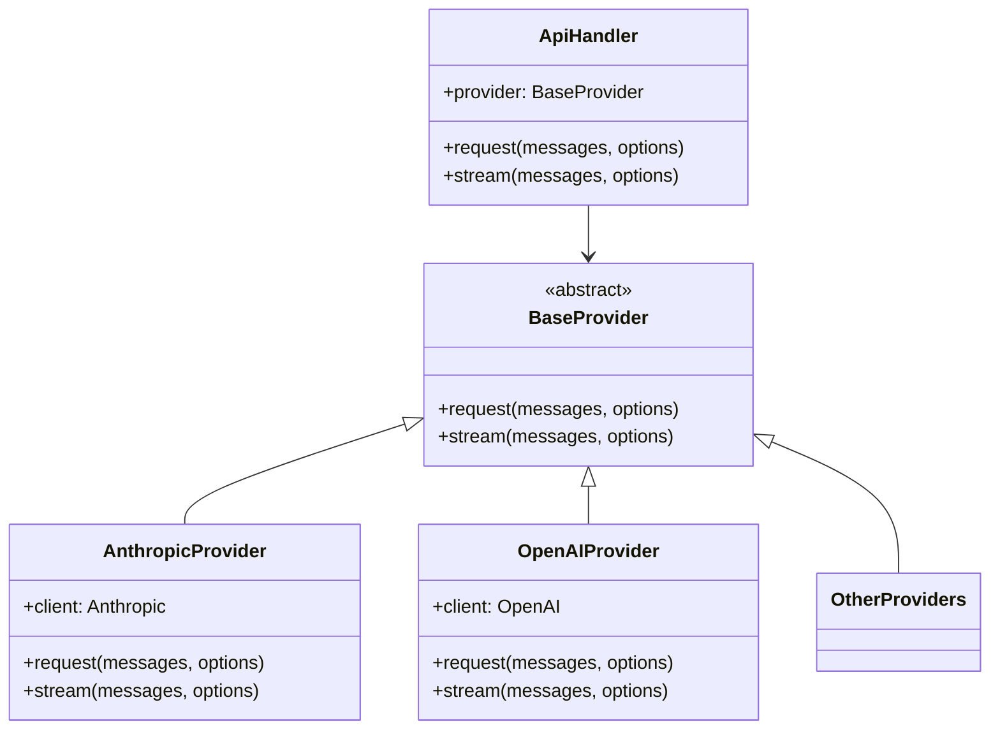
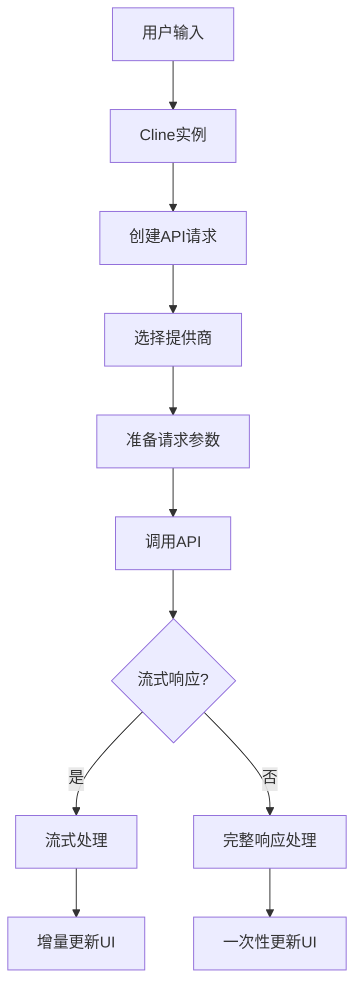
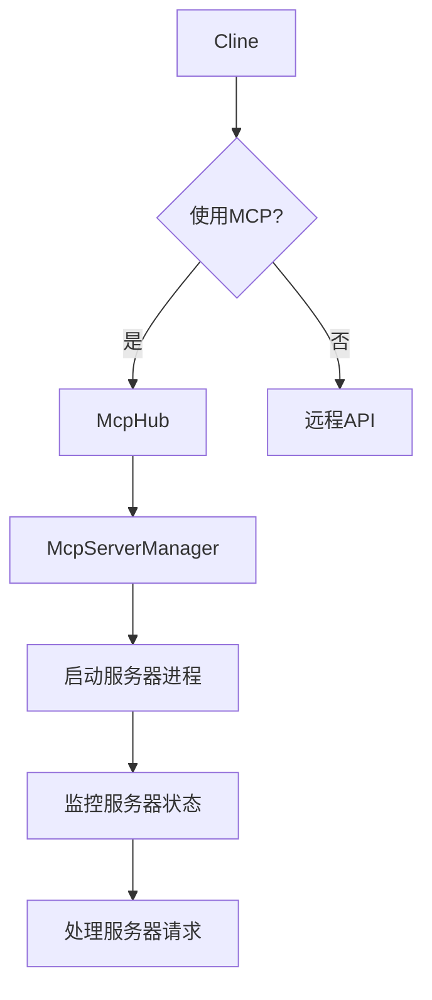
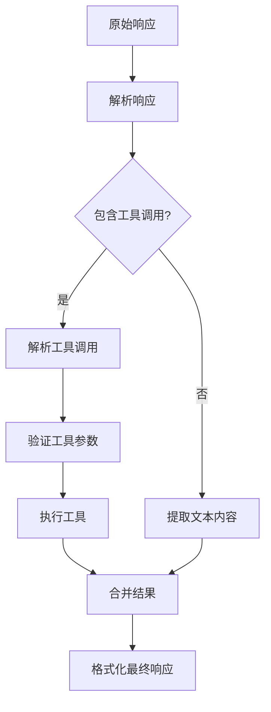
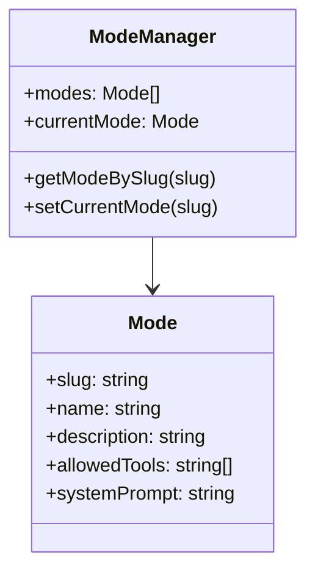
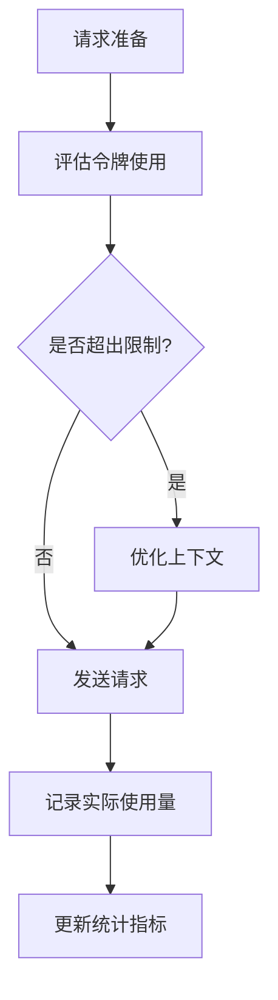
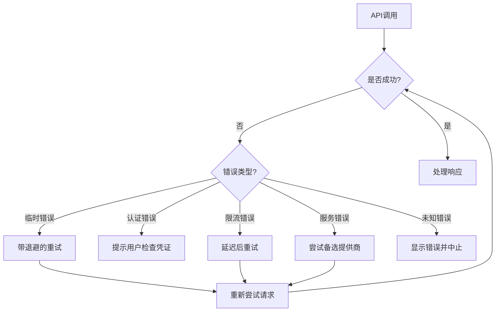
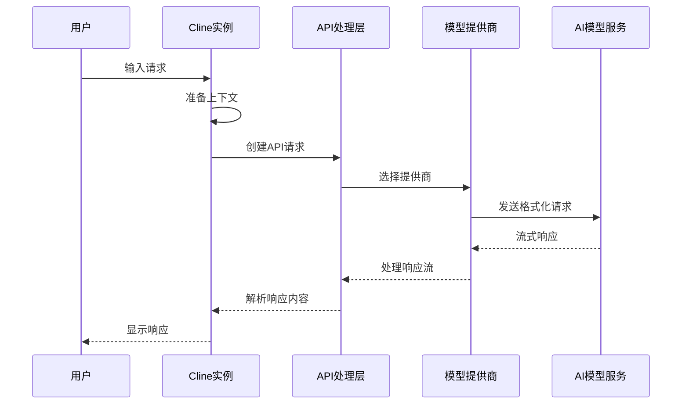
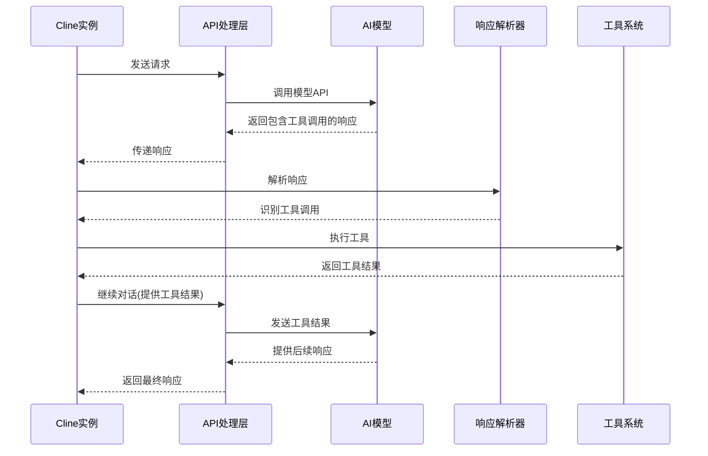

# Roo Code AI模型集成分析

## 1. AI模型集成概述

Roo Code扩展的核心是与各种AI大语言模型的集成，以提供智能编码辅助功能。扩展实现了一套灵活的模型接入架构，支持多种AI提供商，包括Anthropic、OpenAI、OpenRouter等，使用户可以根据需求选择不同的模型服务。

## 2. 模型接入架构

### 2.1 模型提供商抽象层

Roo Code通过`src/api`模块实现了对不同AI模型提供商的统一抽象，使用工厂模式和策略模式创建适配不同API的处理器。

### 2.2 模型请求处理流程

## 3. 支持的AI模型提供商分析

### 3.1 Anthropic集成

**核心功能单元**: `src/api/providers/anthropic.ts`

**输入参数**:
- API密钥
- 消息内容
- 模型参数(温度、最大输出长度等)

**主要处理步骤**:
1. 验证API配置
2. 格式化消息内容
3. 构建Claude API请求
4. 处理流响应

**输出结果**:
- 流式模型响应或完整响应
- 错误信息(如果有)

**副作用**:
- API调用计费

### 3.2 OpenAI集成

**核心功能单元**: `src/api/providers/openai.ts`与`src/api/providers/openai-native.ts`

**输入参数**:
- API密钥
- 消息内容
- 模型参数(温度、最大输出长度等)

**主要处理步骤**:
1. 验证API配置
2. 格式化消息内容
3. 构建OpenAI API请求
4. 处理流响应

**输出结果**:
- 流式模型响应或完整响应
- 错误信息(如果有)

**副作用**:
- API调用计费

### 3.3 OpenRouter集成

**核心功能单元**: `src/api/providers/openrouter.ts`

**输入参数**:
- API密钥
- 消息内容
- 目标模型ID
- 模型参数

**主要处理步骤**:
1. 验证API配置
2. 格式化消息内容
3. 添加OpenRouter特有参数
4. 处理响应

**输出结果**:
- 模型响应
- 元数据(如使用的模型、计费信息)

**副作用**:
- API调用计费
- 不同模型服务的访问

### 3.4 本地模型集成(Ollama)

**核心功能单元**: `src/api/providers/ollama.ts`

**输入参数**:
- 服务器URL
- 模型名称
- 消息内容
- 模型参数

**主要处理步骤**:
1. 验证服务器连接
2. 格式化请求
3. 发送到本地Ollama服务
4. 处理响应

**输出结果**:
- 模型响应
- 服务器状态信息

**副作用**:
- 本地资源使用

## 4. 模型控制协议(MCP)

### 4.1 MCP架构

**核心功能单元**: `src/services/mcp/McpHub.ts`和`src/services/mcp/McpServerManager.ts`

MCP是Roo Code的一个创新功能，允许在本地运行AI模型服务器，提供更好的隐私和定制能力。

**输入参数**:
- 服务器配置
- 模型选择
- 运行参数

**主要处理步骤**:
1. 管理服务器生命周期
2. 处理与服务器的通信
3. 监控服务器状态
4. 错误处理和恢复

**输出结果**:
- 服务器状态信息
- 连接详情

**副作用**:
- 本地资源使用
- 后台进程运行

## 5. 请求与响应处理

### 5.1 请求格式化

AI请求需要特定格式的输入，Roo Code实现了复杂的格式化逻辑:

### 5.2 响应解析

### 5.3 流式处理

Roo Code实现了对流式响应的处理，使得AI响应可以实时显示:

**核心功能单元**: `src/api/transform/stream.ts`

**主要处理步骤**:
1. 建立流式连接
2. 增量处理响应块
3. 实时更新UI
4. 处理流结束或错误

## 6. 模型功能与能力配置

### 6.1 模式系统

Roo Code实现了模式系统，不同模式对应不同的模型能力和限制:

### 6.2 提示工程

系统使用复杂的提示工程来指导模型行为:

**核心功能单元**: `src/core/prompts`

**主要组成**:
1. 系统提示：定义基本行为
2. 指令提示：任务特定指南
3. 工具定义：可用工具描述
4. 样例提示：示范预期行为

## 7. 模型性能优化

### 7.1 上下文窗口管理

大型对话历史可能超出模型上下文窗口限制，Roo Code实现了滑动窗口算法优化上下文:

**核心功能单元**: `src/core/sliding-window`

**主要处理步骤**:
1. 评估对话历史大小
2. 根据重要性打分消息
3. 选择性保留关键消息
4. 压缩或移除低优先级内容

### 7.2 令牌使用优化

## 8. 错误处理与恢复策略

### 8.1 API错误处理

**核心功能单元**: 各提供商实现中的错误处理逻辑

**主要处理策略**:
1. **重试机制**: 临时错误自动重试
2. **降级策略**: 当首选模型不可用时切换备选
3. **超时处理**: 设置合理的超时并优雅处理
4. **用户反馈**: 清晰的错误消息展示

### 8.2 恢复机制

当API调用失败时，系统实现了多种恢复策略:

## 9. 模型能力与局限性

### 9.1 支持的工具与能力

根据不同模型的能力，Roo Code调整可用的工具集:

| 模型类别 | 代码理解 | 代码生成 | 工具使用 | 多模态输入 |
|--------|---------|---------|---------|-----------|
| Claude系列 | 优秀 | 优秀 | 全支持 | 支持 |
| GPT系列 | 优秀 | 优秀 | 全支持 | 部分支持 |
| 开源模型 | 良好 | 良好 | 部分支持 | 有限支持 |

### 9.2 处理模型局限性

针对模型的各种局限性，Roo Code实现了多种解决方案:

1. **上下文长度限制**: 滑动窗口算法
2. **工具使用能力差异**: 适配不同模型的工具调用格式
3. **代码生成质量**: 差异检查和用户确认机制
4. **响应一致性**: 结构化响应格式验证

## 10. 模型交互序列图

### 10.1 基本请求流程

### 10.2 工具调用流程

## 11. 未来发展与优化方向

### 11.1 模型选择的自动化

实现智能模型选择系统，根据任务类型、性能需求和成本考量自动选择最佳模型。

### 11.2 微调与定制

支持特定领域或项目的模型微调，提供更精准的代码生成和分析能力。

### 11.3 混合模型策略

实现多模型协作系统，将不同模型的优势结合，如将大型模型用于复杂理解，小型模型用于常见任务。

## 12. 总结

Roo Code的AI模型集成系统是该扩展的核心，通过灵活的提供商抽象、高效的请求处理和丰富的工具交互，为用户提供了强大的AI编码助手能力。该系统支持多种模型服务，从云端API到本地部署，为不同场景和需求提供了全面解决方案。