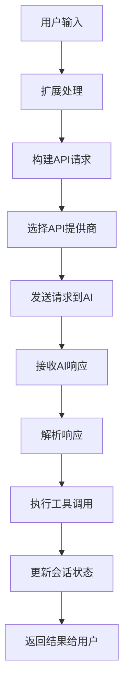
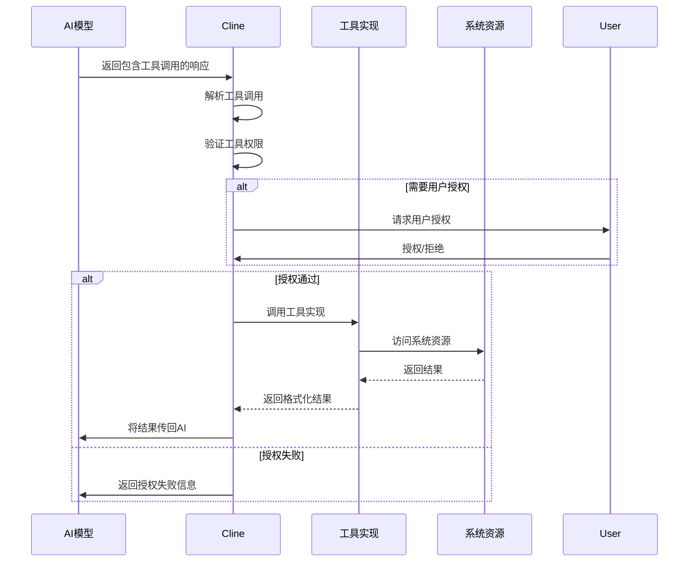
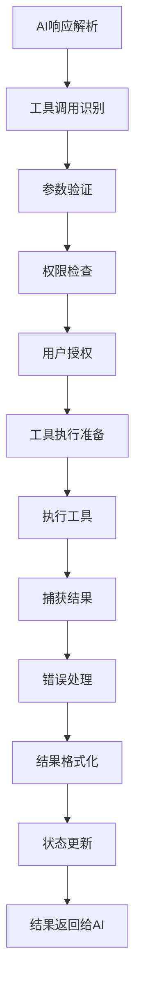
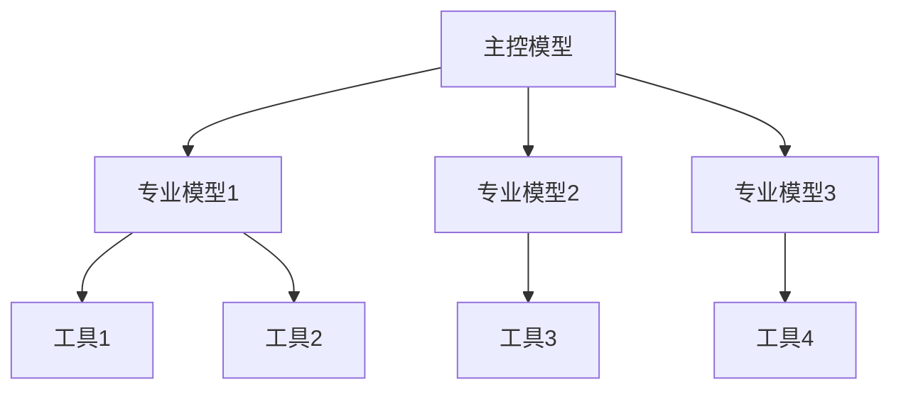

# AI交互与工具体系分析

## 1. AI交互架构概述

CodeFlow项目实现了一套复杂而灵活的AI交互架构，通过多层抽象实现了与不同AI服务提供商的集成，并构建了一套功能丰富的工具体系，使AI能够执行文件操作、代码分析、命令执行等各种任务。

## 2. AI模型集成架构

### 2.1 ApiHandler 设计

**功能描述**：ApiHandler是与AI服务通信的核心组件，它采用适配器模式，支持多种AI服务提供商。

**关键特性**：
- 灵活的提供商切换机制
- 统一的请求和响应格式
- 流式传输支持
- 错误处理与重试机制

**支持的API提供商**：
- Anthropic (Claude系列)
- OpenAI (GPT系列)
- Ollama (本地部署模型)
- LM Studio (本地部署模型)
- OpenRouter (模型路由服务)
- Glama (其他模型服务)
- VSCode LM (VSCode内置模型API)

### 2.2 消息传递流

### 2.3 系统提示与指令设计

项目采用了结构化的系统提示和指令设计：

1. **系统提示**：定义AI助手的基本行为、能力和限制
2. **自定义指令**：允许用户定义额外的行为规则
3. **工具描述**：详细描述可用工具的使用方法和限制
4. **上下文信息**：提供环境、文件结构等信息

## 3. 工具体系架构

### 3.1 工具类型分类

项目实现了丰富的工具体系，大致可分为以下几类：

#### 3.1.1 文件操作工具

| 工具名称 | 功能描述 | 输入参数 | 输出结果 |
|---------|---------|---------|---------|
| readFile | 读取文件内容 | 文件路径、行偏移量、限制行数 | 文件内容 |
| editFile | 编辑现有文件 | 文件路径、编辑内容 | 操作结果 |
| createFile | 创建新文件 | 文件路径、文件内容 | 操作结果 |
| deleteFile | 删除文件 | 文件路径 | 操作结果 |
| renameFile | 重命名文件 | 源路径、目标路径 | 操作结果 |

#### 3.1.2 搜索工具

| 工具名称 | 功能描述 | 输入参数 | 输出结果 |
|---------|---------|---------|---------|
| listDir | 列出目录内容 | 目录路径 | 文件和目录列表 |
| searchCode | 搜索代码 | 搜索关键词、文件类型 | 匹配结果 |
| findDefinition | 查找定义 | 符号名称 | 定义位置 |
| fileSearch | 模糊搜索文件 | 文件名模式 | 匹配的文件列表 |

#### 3.1.3 命令执行工具

| 工具名称 | 功能描述 | 输入参数 | 输出结果 |
|---------|---------|---------|---------|
| executeCommand | 执行命令 | 命令字符串、工作目录 | 命令输出 |
| runTerminalCmd | 运行终端命令 | 命令字符串、说明 | 命令输出 |

#### 3.1.4 代码分析工具

| 工具名称 | 功能描述 | 输入参数 | 输出结果 |
|---------|---------|---------|---------|
| parseCode | 解析代码结构 | 文件路径 | 代码结构信息 |
| getDefinitions | 获取代码定义 | 文件路径 | 函数/类定义列表 |

### 3.2 工具调用流程

### 3.3 工具安全机制

项目实现了多层工具安全机制：

1. **权限分类**：
   - 只读工具：对系统无影响的工具
   - 读写工具：可修改文件系统的工具
   - 执行工具：可执行系统命令的工具

2. **授权机制**：
   - 全局授权：在设置中预先授权
   - 单次授权：每次使用时请求授权
   - 记住授权：记住特定类型的授权决定

3. **工作区限制**：
   - 工作区内操作：默认更宽松的权限
   - 工作区外操作：需要额外的授权

4. **命令过滤**：
   - 允许列表：仅允许特定命令
   - 阻止列表：阻止危险命令
   - 命令检查：分析命令安全性

## 4. 上下文管理

### 4.1 对话上下文构建

项目通过多种方式构建丰富的上下文：

1. **编辑器上下文**：
   - 当前打开的文件
   - 当前选中的代码
   - 最近访问的文件

2. **工作区上下文**：
   - 项目结构信息
   - 关键配置文件内容
   - 文件类型统计

3. **任务上下文**：
   - 任务历史记录
   - 之前的工具调用结果
   - 用户反馈信息

4. **环境上下文**：
   - 操作系统信息
   - 语言和框架版本
   - 终端历史记录

### 4.2 上下文策略

项目采用多种策略管理上下文大小：

1. **滑动窗口机制**：在对话历史过长时，保留最重要的部分
2. **上下文压缩**：将冗长的内容压缩为摘要
3. **选择性包含**：根据相关性选择性地包含文件内容
4. **分级重要性**：对不同类型的上下文赋予不同的重要性级别

## 5. 工具执行生命周期

### 5.1 完整生命周期流程

### 5.2 工具错误处理

项目实现了完善的工具错误处理机制：

1. **类型化错误**：
   - 权限错误
   - 参数错误
   - 执行错误
   - 超时错误

2. **错误恢复策略**：
   - 自动重试机制
   - 错误提示与建议
   - 回退机制

3. **用户干预**：
   - 错误通知
   - 手动纠正选项
   - 中断执行选项

## 6. 交互模式设计

### 6.1 任务驱动模式

**核心特点**：围绕明确的任务目标进行交互。

**典型流程**：
1. 用户提供任务描述
2. AI分析任务并制定计划
3. 执行计划中的步骤，包括工具调用
4. 遇到阻碍时请求用户帮助
5. 任务完成后提供总结

**示例场景**：创建新功能、重构代码、修复错误等。

### 6.2 对话驱动模式

**核心特点**：通过自然对话进行交互，更加灵活。

**典型流程**：
1. 用户提出问题或请求
2. AI根据上下文响应
3. 根据需要调用工具获取信息
4. 继续对话，深入讨论
5. 渐进式完成任务

**示例场景**：代码解释、概念澄清、解决方案讨论等。

### 6.3 混合模式

**核心特点**：结合任务驱动和对话驱动的特点，根据场景动态切换。

**典型流程**：
1. 从对话开始，理解用户需求
2. 转为任务驱动模式执行具体任务
3. 遇到问题时回到对话模式获取更多信息
4. 任务完成后通过对话提供解释和建议

**示例场景**：复杂项目规划、系统设计、问题诊断等。

## 7. 多模型协作模式

### 7.1 分层模型架构

项目支持多种模型协作的分层架构：

### 7.2 主要协作模式

1. **分工模式**：不同模型负责不同的专业领域
2. **增强模式**：辅助模型增强主模型的特定能力
3. **评审模式**：辅助模型评审主模型的输出
4. **交替模式**：多个模型交替处理不同任务阶段

## 8. 持续改进机制

### 8.1 学习回路

项目实现了完整的学习回路，用于持续改进AI性能：

1. **用户反馈收集**：收集明确和隐含的用户反馈
2. **问题模式识别**：识别常见问题和失败模式
3. **提示优化**：根据反馈优化系统提示和指令
4. **工具增强**：增强现有工具或添加新工具
5. **行为校准**：调整AI的行为以更好地满足用户需求

### 8.2 反馈渠道

1. **直接反馈**：用户明确提供的反馈
2. **间接反馈**：通过用户行为推断（如接受/拒绝建议）
3. **遥测数据**：使用模式和成功率数据
4. **错误报告**：系统错误和工具失败报告

## 9. 关键挑战与解决方案

### 9.1 工具执行超时

**挑战**：长时间运行的工具可能导致UI冻结和用户体验下降。

**解决方案**：
- 实现超时机制，自动中断长时间运行的工具
- 将耗时操作放入后台线程
- 提供进度反馈和取消选项

### 9.2 上下文长度限制

**挑战**：模型的上下文长度有限，无法包含所有相关信息。

**解决方案**：
- 智能上下文裁剪和压缩
- 实现上下文滑动窗口机制
- 采用多轮交互策略，逐步提供信息

### 9.3 工具调用冗余

**挑战**：AI可能重复调用相同的工具或进行无效的工具调用。

**解决方案**：
- 缓存工具调用结果
- 提供明确的工具使用指导
- 实现工具调用检测和优化

### 9.4 差异应用问题

**挑战**：应用代码差异时可能出现冲突或不一致。

**解决方案**：
- 实现智能差异合并策略
- 提供用户审阅和修改机制
- 支持逐步应用和回滚功能

## 10. 总结

CodeFlow项目的AI交互与工具体系是一个复杂而精心设计的架构，它通过以下关键特性提供了强大的开发辅助能力：

1. **灵活的AI集成**：支持多种AI模型和服务提供商
2. **丰富的工具生态**：实现了全面的文件、搜索、命令执行和分析工具
3. **严格的安全机制**：多层权限控制和用户授权机制
4. **智能的上下文管理**：构建丰富而相关的上下文信息
5. **多样的交互模式**：支持任务驱动、对话驱动和混合模式
6. **持续的改进机制**：通过用户反馈不断优化系统

这种架构不仅使AI能够理解和操作代码，还能执行复杂的开发任务，极大地提升了开发效率和用户体验。 