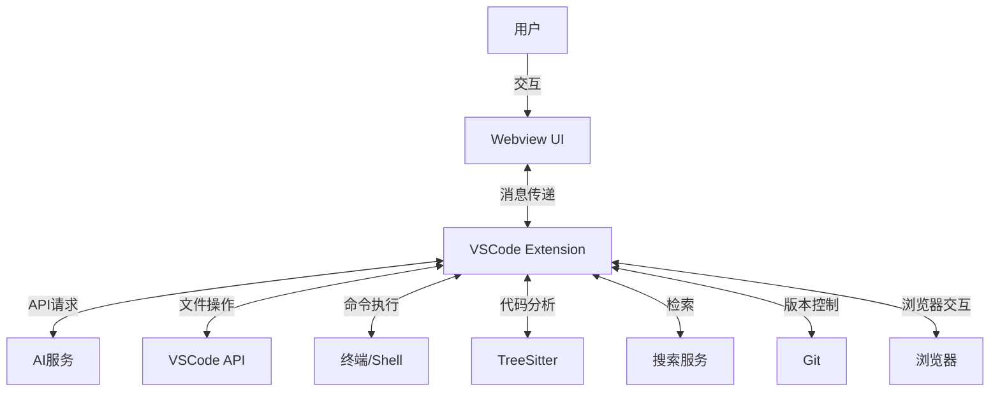
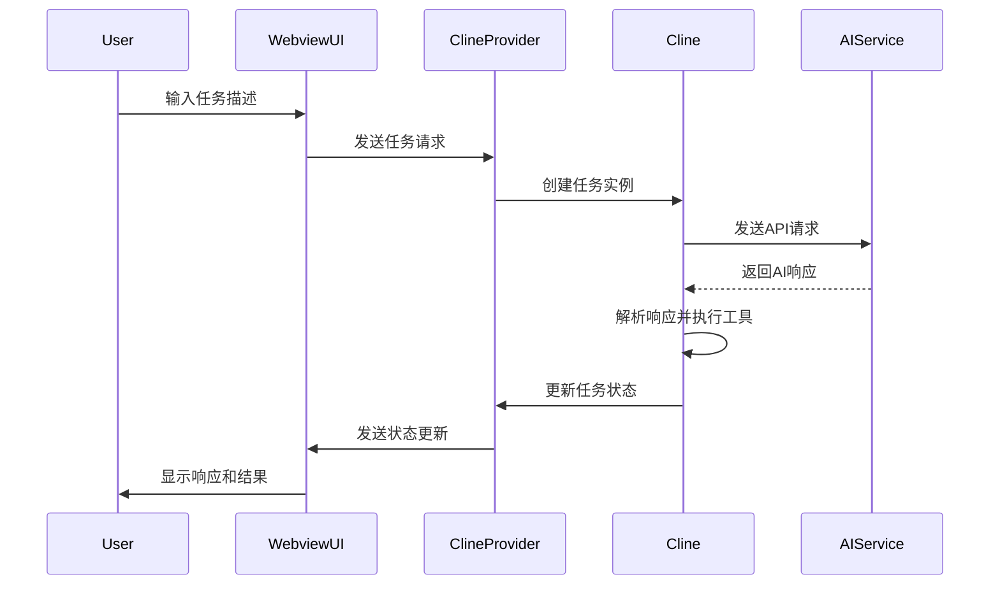
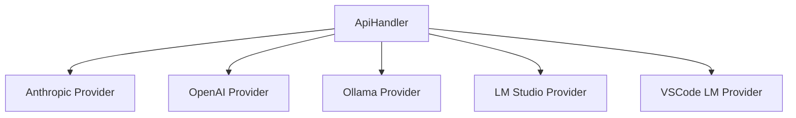
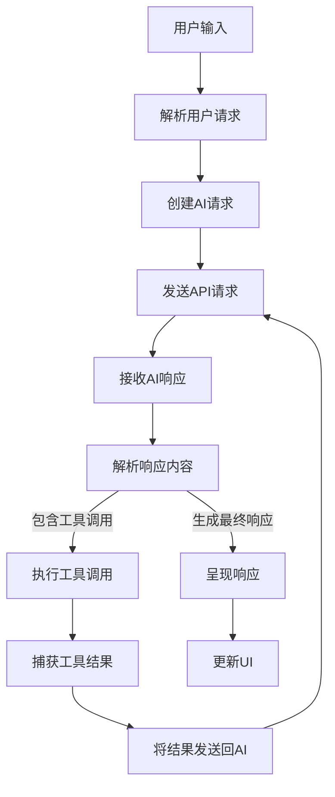
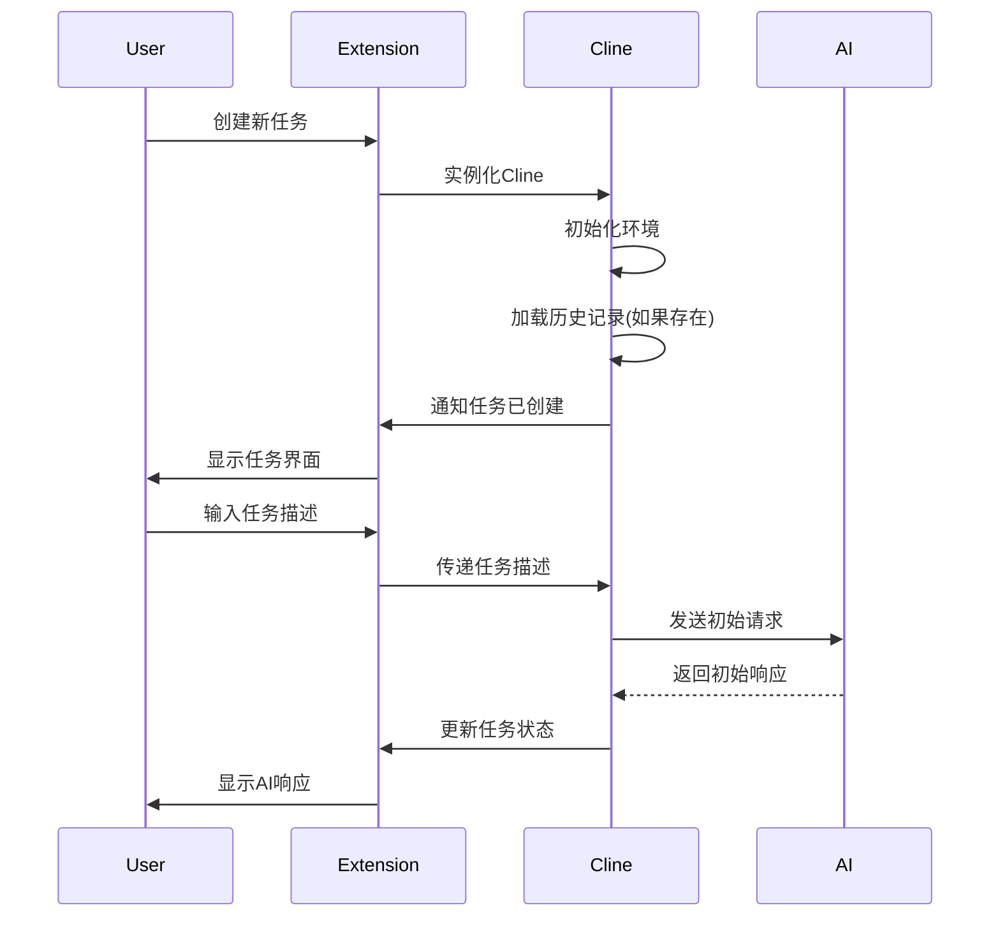
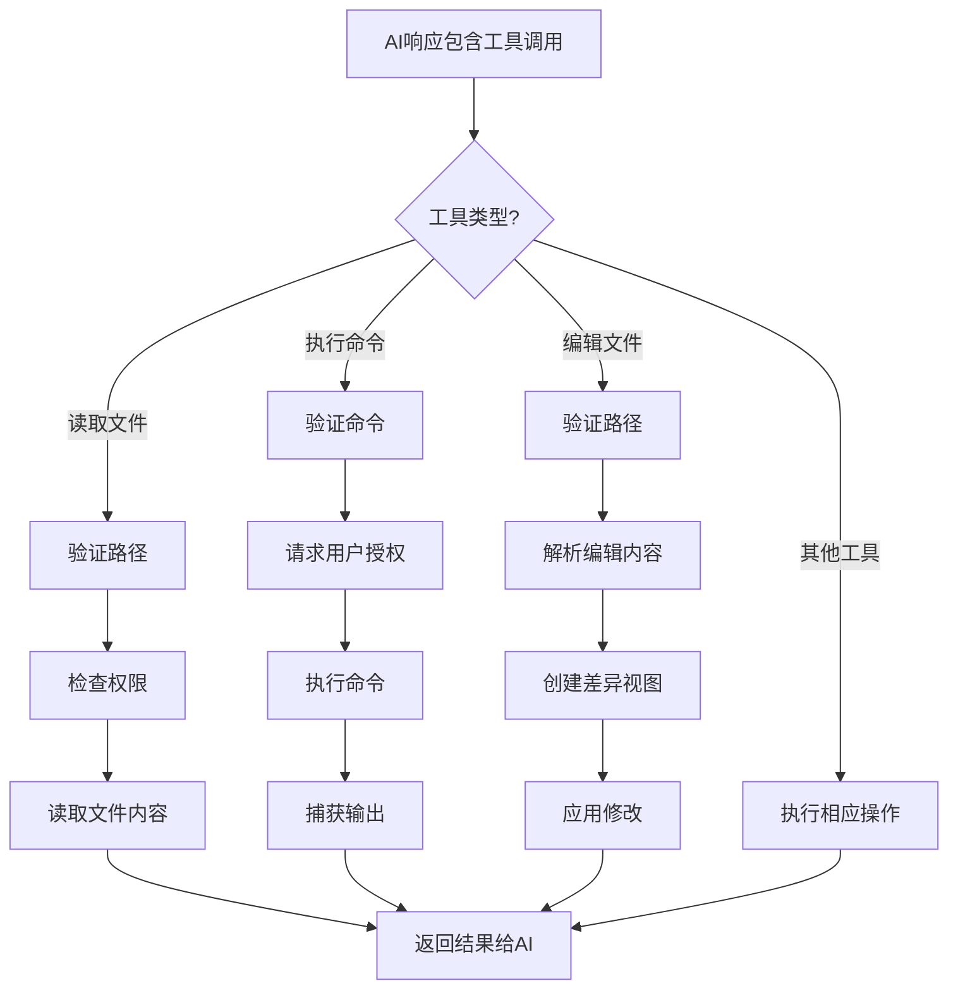

# CodeFlow 项目架构与功能分析

## 1. 项目概述

CodeFlow 是一个VSCode扩展，提供AI辅助编码功能，允许用户通过自然语言交互与AI模型沟通，完成各种编程任务。项目主要集成了多种AI模型（如Anthropic Claude系列等）进行代码生成、解释、重构等任务。

## 2. 核心架构

项目采用典型的VSCode扩展架构，分为两大部分：
- 后端（Extension）：用TypeScript编写，运行在Node.js环境
- 前端（Webview UI）：用React编写的Web应用，嵌入在VSCode界面中

### 2.1 系统组件图

## 3. 核心功能模块分析

### 3.1 Cline 类 (`src/core/Cline.ts`)

**功能描述**：Cline是项目的核心类，负责管理与AI模型的交互、处理用户请求，并执行各种工具函数。

**输入参数**：
- `provider`: ClineProvider 实例，用于与UI通信
- `apiConfiguration`: API配置信息
- `customInstructions`: 可选的自定义指令
- `enableDiff`: 是否启用差异比较功能
- `enableCheckpoints`: 是否启用检查点功能
- `task`: 任务描述
- `images`: 可选的图片列表

**主要处理步骤**：
1. 初始化任务环境和会话状态
2. 管理与AI模型的对话历史
3. 处理用户请求并发送至AI模型
4. 解析AI模型响应并执行相应工具操作
5. 管理任务的生命周期（开始、暂停、继续、终止）

**输出结果**：
- 产生AI响应和执行工具操作的结果
- 更新UI界面的消息和状态

**副作用**：
- 可能修改文件系统（创建、编辑、删除文件）
- 可能执行命令（在用户授权下）
- 创建版本控制检查点

### 3.2 ClineProvider 类 (`src/core/webview/ClineProvider.ts`)

**功能描述**：管理Webview界面，处理UI和扩展之间的通信。

**输入参数**：
- `context`: VSCode扩展上下文
- `outputChannel`: 输出通道
- `renderContext`: 渲染上下文（"sidebar"或"editor"）

**主要处理步骤**：
1. 初始化和管理Webview
2. 处理来自Webview的消息
3. 将扩展状态和消息发送到Webview
4. 管理多个Cline实例（任务）

**输出结果**：
- 向Webview发送状态更新和消息
- 创建和管理Cline实例

**副作用**：
- 维护扩展状态和历史记录

### 3.3 ApiHandler 类 (`src/api/index.ts`)

**功能描述**：处理与不同AI服务提供商的API通信。

**输入参数**：
- `config`: API配置信息
- `outputChannel`: 输出通道

**主要处理步骤**：
1. 根据配置选择合适的API提供商
2. 处理API请求的格式化和发送
3. 处理API响应的解析
4. 管理API请求的流式传输和中断

**输出结果**：
- AI模型的响应数据

**副作用**：
- 记录API使用的指标和日志

### 3.4 工具函数体系

项目实现了丰富的工具函数，供AI模型使用：

#### 3.4.1 文件操作工具

**功能描述**：允许AI读取、创建、编辑和删除文件。

**处理步骤**：
1. 验证文件路径和操作权限
2. 执行相应的文件系统操作
3. 返回操作结果或文件内容

#### 3.4.2 代码分析工具

**功能描述**：使用TreeSitter等工具分析源代码结构。

**处理步骤**：
1. 解析源代码为AST
2. 提取函数、类和其他定义
3. 返回结构化的代码信息

#### 3.4.3 搜索工具

**功能描述**：提供文件内容搜索功能。

**处理步骤**：
1. 使用正则表达式或文本进行搜索
2. 过滤搜索结果
3. 返回匹配的文件和行号

#### 3.4.4 终端命令执行

**功能描述**：允许AI在用户授权下执行命令。

**处理步骤**：
1. 验证命令安全性和用户权限
2. 在子进程中执行命令
3. 捕获并返回命令输出

#### 3.4.5 差异比较与应用

**功能描述**：生成代码差异并应用修改。

**处理步骤**：
1. 计算原始代码和目标代码的差异
2. 创建差异视图供用户审阅
3. 应用用户确认的差异修改

## 4. 通信机制分析

### 4.1 Extension 与 Webview 通信

通过VSCode的Webview API实现扩展和UI之间的通信：

### 4.2 AI 模型集成

项目支持多种AI服务集成，主要通过适配器模式实现：

## 5. 数据流分析

任务执行的主要数据流:

## 6. 关键流程分析

### 6.1 任务初始化流程

### 6.2 工具执行流程

## 7. 主要功能场景

### 7.1 代码解释场景

用户可以选择代码片段并请求AI解释其功能和工作原理。

### 7.2 代码生成场景

用户可以提供功能描述，AI会生成相应的代码并可能创建新文件或编辑现有文件。

### 7.3 代码重构场景

AI可以分析现有代码并提出改进建议，生成重构后的代码供用户审阅和应用。

### 7.4 问题排查场景

用户可以描述代码问题，AI会分析相关代码并提供解决方案。

## 8. 存储和状态管理

项目使用多种存储机制管理状态：
- VSCode扩展存储API保存全局配置和历史记录
- 文件系统保存任务历史和检查点
- 内存中保存活跃任务状态

## 9. 安全和权限机制

项目实现了多层权限控制：
- 文件读写权限控制
- 命令执行权限控制
- 工作区内外操作的不同权限策略
- 用户明确授权机制

## 10. 总结

CodeFlow是一个复杂而功能丰富的VSCode扩展，通过集成AI大模型和各种工具功能，提供了智能化的编程辅助体验。其核心优势在于：

1. 灵活的AI模型集成架构
2. 丰富的工具函数支持
3. 完善的权限和安全控制
4. 用户友好的交互界面
5. 强大的代码分析和处理能力

项目的模块化设计使其易于扩展和维护，同时保证了高效的性能和用户体验。 