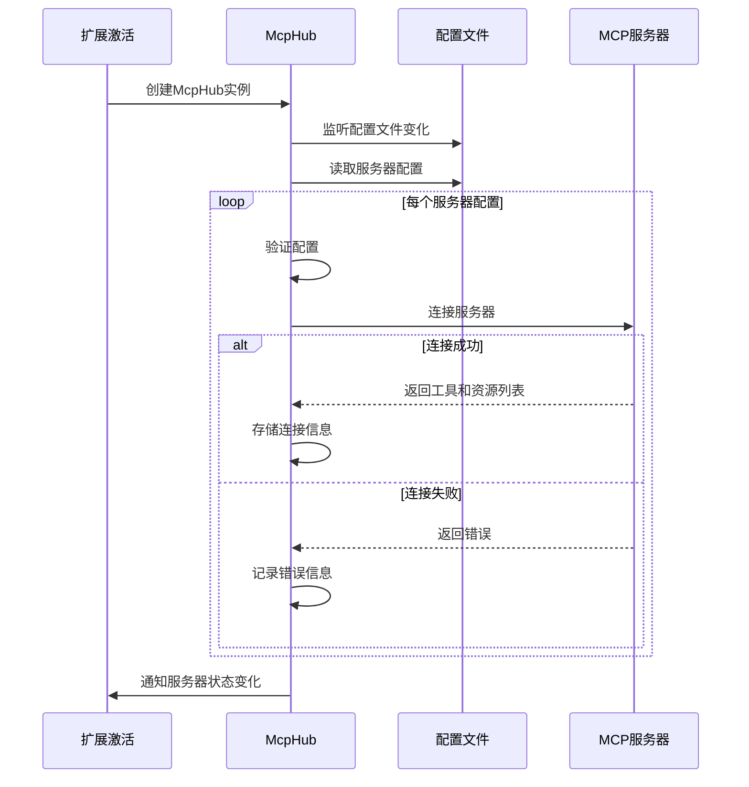
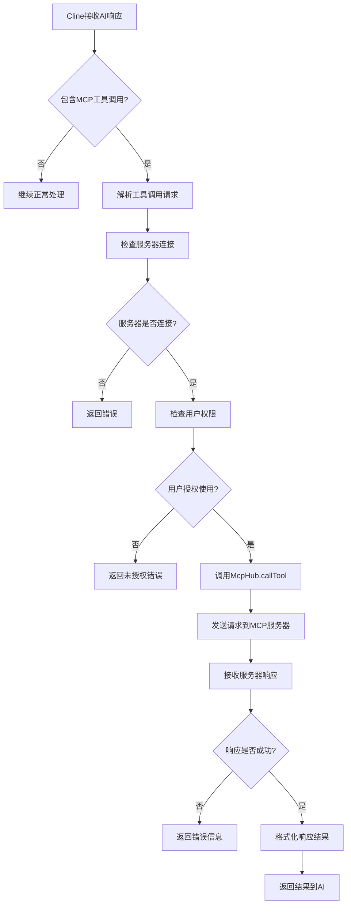
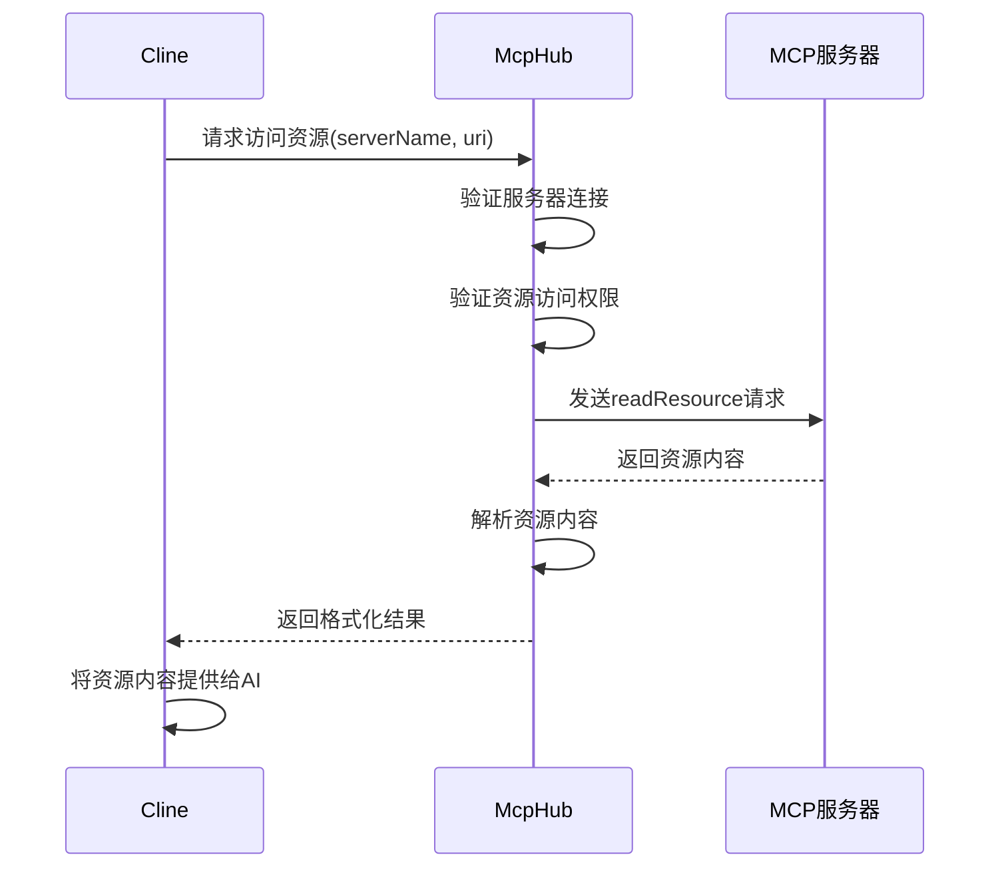
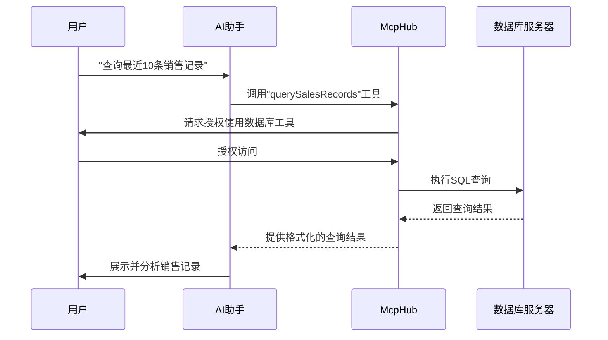
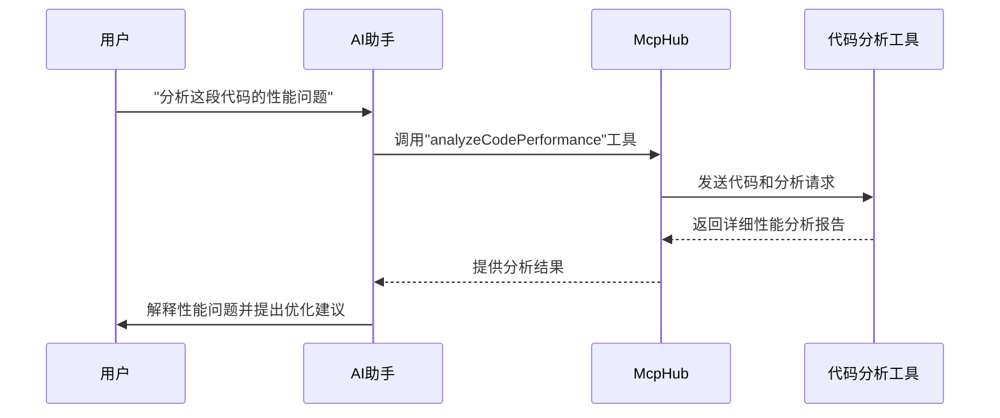

# MCP (Model Context Protocol) 模块分析

## 1. 模块概述

MCP（Model Context Protocol）是CodeFlow项目中的一个重要模块，它允许AI模型与外部服务和资源进行交互。通过MCP，AI模型可以调用专门的工具服务器、访问外部资源，极大地扩展了AI助手的能力范围，使其能够执行更加复杂和专业化的任务。

## 2. MCP核心组件

### 2.1 McpHub 类

**功能描述**：McpHub是MCP模块的核心类，负责管理与MCP服务器的连接、初始化、配置处理和资源访问。

**输入参数**：
- `provider`: ClineProvider实例，用于与UI通信

**主要处理步骤**：
1. 初始化MCP服务器连接
2. 监听配置文件变化
3. 管理服务器状态（连接、断开、重启）
4. 处理工具调用和资源访问请求

**输出结果**：
- 提供MCP服务器连接列表
- 返回工具调用和资源访问的结果

**副作用**：
- 维护外部MCP服务器的连接状态
- 在文件系统中创建和修改MCP配置文件

### 2.2 McpServerManager 类

**功能描述**：管理MCP服务器的生命周期，包括清理和状态维护。

**主要处理步骤**：
1. 初始化服务器管理器
2. 在扩展关闭时进行清理工作

**副作用**：
- 确保在扩展关闭时MCP服务器连接被正确关闭

## 3. MCP数据模型

### 3.1 McpServer

```typescript
type McpServer = {
    name: string                   // 服务器名称
    config: string                 // 配置内容
    status: "connected" | "connecting" | "disconnected"  // 连接状态
    error?: string                 // 错误信息
    tools?: McpTool[]              // 提供的工具列表
    resources?: McpResource[]      // 提供的资源列表
    resourceTemplates?: McpResourceTemplate[]  // 资源模板
    disabled?: boolean             // 是否禁用
    timeout?: number               // 超时设置
}
```

### 3.2 McpTool

```typescript
type McpTool = {
    name: string                   // 工具名称
    description?: string           // 工具描述
    inputSchema?: object           // 输入参数模式
    alwaysAllow?: boolean          // 是否总是允许使用
}
```

### 3.3 McpResource

```typescript
type McpResource = {
    uri: string                    // 资源URI
    name: string                   // 资源名称
    mimeType?: string              // MIME类型
    description?: string           // 资源描述
}
```

### 3.4 McpResourceTemplate

```typescript
type McpResourceTemplate = {
    uriTemplate: string            // URI模板
    name: string                   // 模板名称
    description?: string           // 模板描述
    mimeType?: string              // MIME类型
}
```

## 4. MCP服务器配置

MCP模块支持两种类型的服务器配置：

### 4.1 Stdio 类型服务器

```json
{
  "type": "stdio",
  "command": "node path/to/server.js",
  "args": ["--port=8080"],
  "env": { "NODE_ENV": "production" },
  "timeout": 60,
  "alwaysAllow": ["tool1", "tool2"],
  "watchPaths": ["path/to/watch"]
}
```

### 4.2 SSE 类型服务器

```json
{
  "type": "sse",
  "url": "http://localhost:8080/events",
  "headers": { "Authorization": "Bearer token" },
  "timeout": 60,
  "alwaysAllow": ["tool1", "tool2"]
}
```

## 5. 工作流程分析

### 5.1 初始化流程



### 5.2 工具调用流程



### 5.3 资源访问流程



## 6. 错误处理与重试策略

McpHub实现了健壮的错误处理和重试策略：

1. **配置验证错误**：在加载配置时严格验证，提供详细的错误信息
2. **连接失败处理**：记录错误并允许重新连接
3. **工具调用超时**：实现超时机制，避免无限等待
4. **自动重连机制**：监测连接状态，在断开时尝试重新连接
5. **文件变化监测**：当配置或相关文件变化时，自动重启服务器连接

## 7. 权限管理

MCP模块实现了多层权限控制：

1. **服务器级别启用/禁用**：可以全局启用或禁用特定服务器
2. **工具级别权限**：可以为特定工具设置"始终允许"标志
3. **用户授权机制**：对于未标记为"始终允许"的工具，需要用户明确授权才能使用
4. **超时控制**：设置工具调用的最大执行时间，防止长时间占用资源

## 8. 交互场景示例

### 8.1 数据库查询场景



### 8.2 专业分析工具场景



## 9. 扩展性设计

MCP模块采用可扩展的设计：

1. **协议标准化**：采用标准化的Model Context Protocol
2. **多种连接方式**：支持Stdio和SSE两种连接模式
3. **插件化架构**：新的工具服务器可以作为插件集成
4. **动态发现**：自动发现工具和资源，无需手动配置
5. **配置热更新**：支持在不重启扩展的情况下更新配置

## 10. 总结

MCP模块是CodeFlow项目中扩展AI能力的核心组件，通过标准化的协议实现了AI与外部工具和资源的无缝集成。它的主要优势在于：

1. **能力扩展**：让AI能够访问专业工具和外部资源
2. **标准化接口**：采用统一的协议标准，便于集成各种工具
3. **安全可控**：实现了多层权限控制，保障系统安全
4. **可靠性**：具备健壮的错误处理和恢复机制
5. **灵活配置**：支持多种服务器类型和配置选项

这种设计使得AI助手可以根据用户需求调用专门的工具，大大提升了智能助手的实用性和价值。 