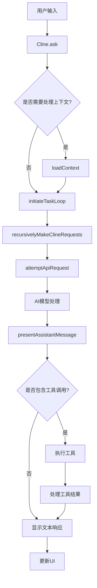
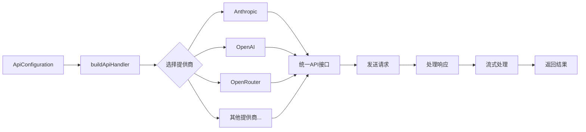
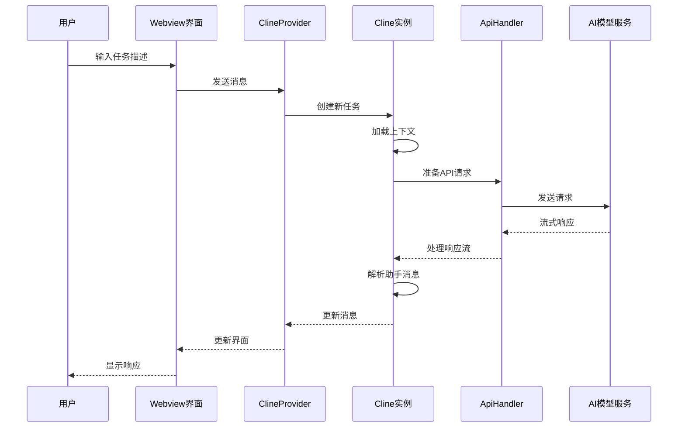
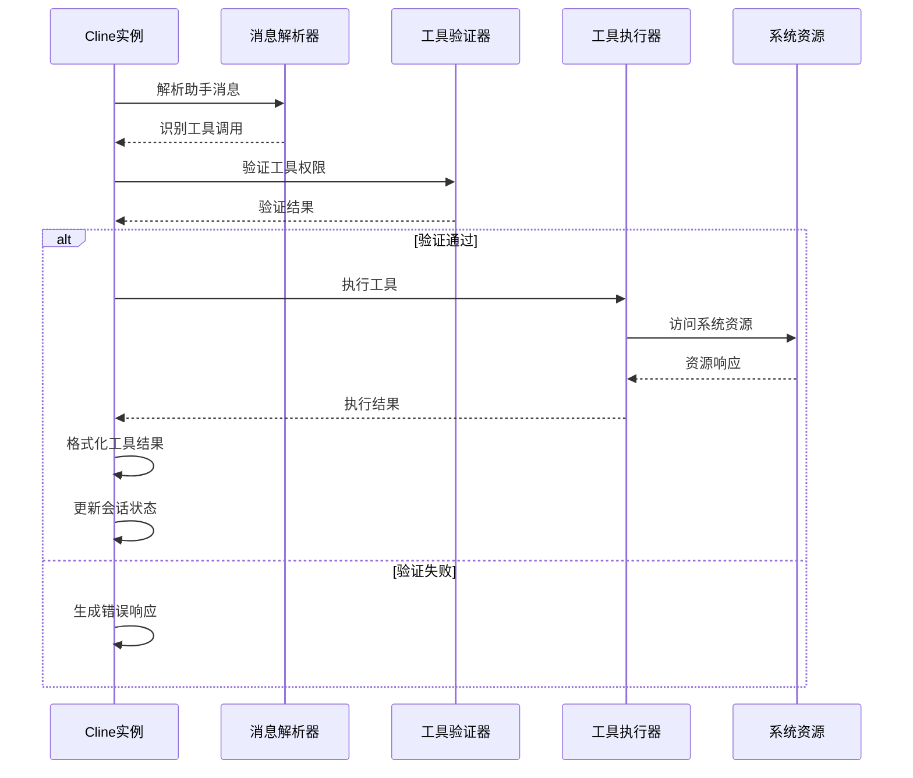
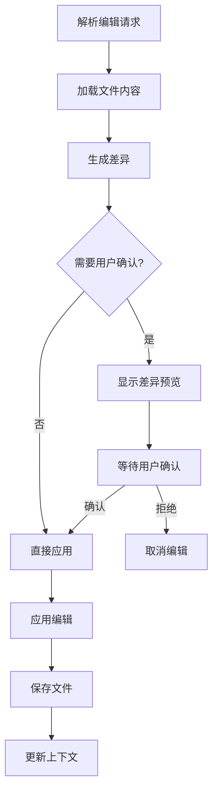
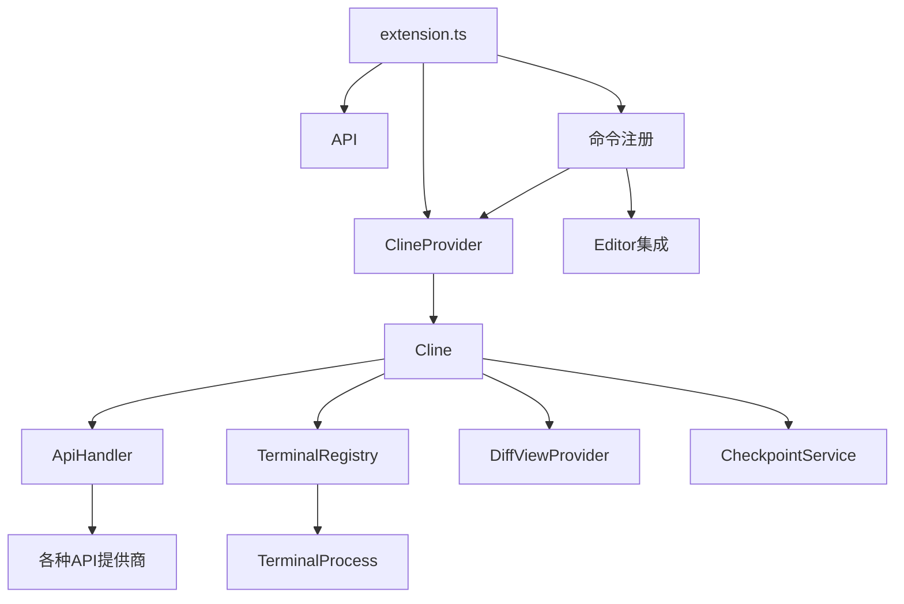

# Roo Code VSCode扩展项目分析

## 1. 项目概述

Roo Code（前身为Roo Cline）是一个VSCode扩展，提供了在代码编辑器中集成AI助手的功能。该扩展允许用户通过AI助手执行各种编码任务，如代码解释、修复、改进等。项目使用TypeScript开发，支持多种AI模型提供商，并提供了丰富的功能集成到VSCode环境中。

## 2. 核心功能模块分析

### 2.1 Cline类 (`src/core/Cline.ts`)

**核心功能单元**：Cline是整个项目的核心类，负责处理AI交互会话。

**输入参数**：
- `provider`: ClineProvider实例，用于UI展示
- `apiConfiguration`: API配置信息
- `customInstructions`: 自定义指令
- `enableDiff`: 是否启用差异比较功能
- `task`: 任务文本
- `images`: 图像列表
- 等其他配置参数

**主要处理步骤**：
1. 初始化会话上下文和状态
2. 管理与AI模型的对话历史
3. 处理用户输入请求
4. 协调工具调用和执行
5. 管理检查点和差异比较功能

**输出结果**：
- 生成的AI响应
- 工具执行结果
- 用户界面更新

**副作用**：
- 文件系统修改（当执行编辑操作时）
- 创建检查点（当启用检查点功能时）
- 执行终端命令（当使用命令工具时）

### 2.2 ClineProvider类 (`src/core/webview/ClineProvider.ts`)

**核心功能单元**：负责管理VSCode中的Webview界面，处理UI交互和状态管理。

**输入参数**：
- `context`: VSCode扩展上下文
- `outputChannel`: 日志输出通道
- `viewType`: 视图类型

**主要处理步骤**：
1. 创建和管理Webview界面
2. 处理来自Webview的消息
3. 管理任务和会话状态
4. 协调与Cline实例的交互

**输出结果**：
- 用户界面展示
- 任务状态管理

**副作用**：
- 创建新的Cline实例
- 管理多个任务会话

### 2.3 API处理模块 (`src/api`)

**核心功能单元**：管理与不同AI提供商的API交互。

**输入参数**：
- API配置信息
- 请求内容和参数

**主要处理步骤**：
1. 根据配置选择适当的API提供商
2. 格式化请求数据
3. 发送API请求
4. 处理流式响应
5. 错误处理和重试

**输出结果**：
- API响应数据流
- 错误信息

**副作用**：
- 网络请求
- 令牌使用统计

### 2.4 终端集成模块 (`src/integrations/terminal`)

**核心功能单元**：提供与VSCode终端的集成功能。

**输入参数**：
- 命令文本
- 执行环境配置

**主要处理步骤**：
1. 创建或获取终端实例
2. 执行命令
3. 捕获命令输出
4. 将输出传递给AI处理

**输出结果**：
- 命令执行结果
- 执行状态信息

**副作用**：
- 系统命令执行
- 终端状态变更

### 2.5. MCP（Model Control Protocol）模块 (`src/services/mcp`)

**核心功能单元**：管理本地模型服务器。

**输入参数**：
- 服务器配置
- 运行参数

**主要处理步骤**：
1. 启动和管理模型服务器
2. 监控服务器状态
3. 处理服务器通信

**输出结果**：
- 服务器状态信息
- 连接细节

**副作用**：
- 启动外部进程
- 端口占用

## 3. 逻辑分析

### 3.1 控制流路径

项目主要控制流程围绕用户与AI助手的交互展开：

1. **初始化流程**：
   - 扩展激活时，创建必要的服务和提供商
   - 注册命令和事件处理器
   - 初始化Webview界面

2. **用户交互流程**：
   - 用户输入请求
   - 请求被转发给Cline实例处理
   - Cline加载上下文并准备API请求
   - 发送请求到AI模型服务
   - 处理流式响应
   - 解析工具调用并执行
   - 更新UI显示结果

3. **工具执行流程**：
   - 解析助手消息中的工具调用
   - 验证工具权限
   - 执行相应工具功能
   - 捕获工具执行结果
   - 将结果反馈给AI进行后续处理

### 3.2 数据转换过程

项目涉及多种数据转换：

1. **用户输入转换**：
   - 文本输入转换为API请求格式
   - 文件内容转换为上下文信息
   - 代码选择转换为结构化请求

2. **API响应转换**：
   - 流式响应解析为消息内容
   - 工具调用解析和格式化
   - 响应内容转换为UI展示格式

3. **文件操作转换**：
   - 差异比较生成
   - 代码编辑应用
   - 检查点保存和恢复

### 3.3 核心算法实现

1. **滑动窗口上下文管理**：
   - 使用滑动窗口算法管理对话历史
   - 优化上下文大小以适应模型限制

2. **差异检测和应用**：
   - 使用差异比较算法分析代码变更
   - 智能应用编辑以避免冲突

3. **工具调用解析**：
   - 解析AI响应中的结构化工具调用
   - 验证参数完整性和合法性

### 3.4 错误处理策略

1. **API错误处理**：
   - 重试机制处理临时性错误
   - 降级策略处理持续性问题

2. **工具执行错误处理**：
   - 捕获工具执行异常
   - 友好错误消息展示
   - 提供修复建议

3. **用户界面错误处理**：
   - 状态同步机制
   - 错误恢复选项
   - 会话状态保存

## 4. 交互场景序列图

### 4.1 用户发起新任务

### 4.2 执行工具调用流程

### 4.3 代码编辑流程

## 5. 模块依赖关系

项目模块之间存在复杂的依赖关系，主要模块依赖如下：

## 6. 关键实现细节

### 6.1 AI模型集成

项目支持多种AI模型提供商，包括：
- Anthropic (Claude)
- OpenAI
- OpenRouter
- Vertex AI
- Mistral
- Ollama
- 等其他提供商

每个提供商都有专门的适配器实现，确保统一的API接口。

### 6.2 工具系统

扩展实现了丰富的工具系统，允许AI助手执行各种操作：
- 文件读写
- 代码编辑
- 终端命令执行
- Web搜索
- 正则表达式搜索
- 等多种功能

工具系统使用权限控制机制，确保安全执行。

### 6.3 检查点系统

项目实现了代码检查点功能，允许：
- 保存代码状态
- 比较历史变更
- 恢复先前版本
- 提供差异预览

### 6.4 国际化支持

通过i18n模块提供多语言支持，使扩展可以在不同语言环境中使用。

## 7. 总结

Roo Code VSCode扩展是一个复杂而功能丰富的AI编码助手工具。它通过与各种AI模型的集成，提供了代码理解、生成、编辑等功能，并通过丰富的工具系统扩展了AI助手的能力。项目结构清晰，模块化设计良好，支持扩展和定制。其核心价值在于将AI能力无缝集成到开发环境中，提升开发效率和代码质量。