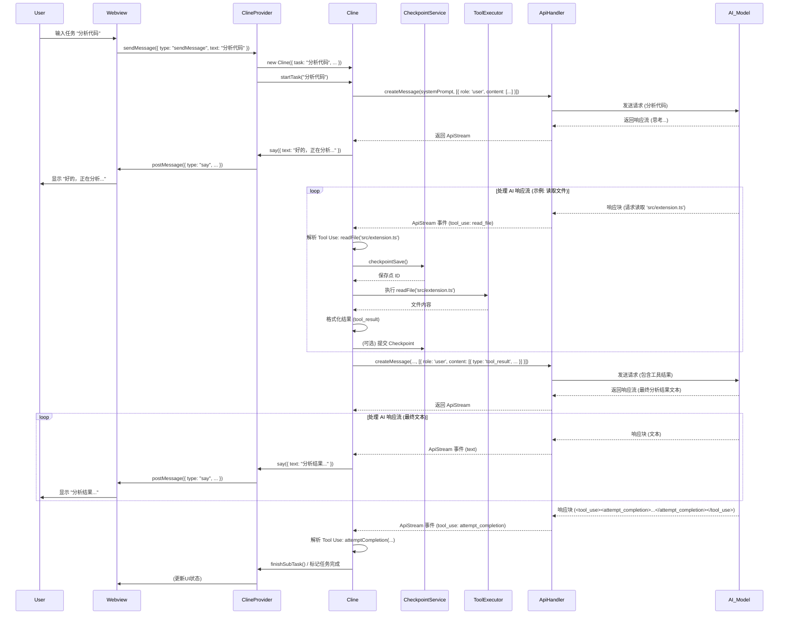

# Roo-Code 项目源代码分析报告

本报告对 Roo-Code VS Code 扩展的源代码进行了深入分析，识别了其核心功能单元，阐述了它们的功能和交互，分析了关键逻辑流程，并生成了可视化图表。

## 1. 核心功能单元分析

本节详细描述 Roo-Code 扩展的关键功能单元，包括其主要职责、输入、处理步骤、输出和可能的副作用。

### 1.1. `src/extension.ts` (扩展入口)

*   **主要职责:** 作为 VS Code 扩展的入口点，负责在扩展激活 (`activate`) 和停用 (`deactivate`) 时执行初始化和清理操作。它编排了核心服务、UI 提供者和命令的注册。
*   **输入:**
    *   `vscode.ExtensionContext`: VS Code 提供的扩展上下文对象，用于访问 API、状态存储和资源。
    *   VS Code 激活事件 (首次执行命令或启动时)。
    *   `.env` 文件 (通过 `@dotenvx/dotenvx` 加载)。
    *   VS Code 配置 (`vscode.workspace.getConfiguration`)。
    *   VS Code 环境语言 (`vscode.env.language`)。
*   **主要处理步骤 (`activate`):**
    1.  创建并注册输出通道 (`vscode.window.createOutputChannel`)。
    2.  加载 `.env` 环境变量。
    3.  执行设置迁移 (`migrateSettings`)。
    4.  初始化遥测服务 (`telemetryService.initialize`)。
    5.  初始化国际化 (`initializeI18n`)。
    6.  初始化终端注册表 (`TerminalRegistry.initialize`)。
    7.  初始化全局状态 (如 `allowedCommands`)。
    8.  实例化核心 UI 提供者 `ClineProvider`。
    9.  将 `ClineProvider` 注册为 Webview 视图提供者 (`vscode.window.registerWebviewViewProvider`)。
    10. 注册扩展命令 (`registerCommands`)。
    11. 注册文本内容提供者 (`vscode.workspace.registerTextDocumentContentProvider`) 用于 Diff 视图。
    12. 注册 URI 处理器 (`vscode.window.registerUriHandler`)。
    13. 注册代码操作提供者 (`vscode.languages.registerCodeActionsProvider`)。
    14. 注册代码操作和终端操作的具体实现 (`registerCodeActions`, `registerTerminalActions`)。
    15. 返回一个 `API` 实例，供外部使用。
*   **主要处理步骤 (`deactivate`):**
    1.  清理 MCP 服务器管理器 (`McpServerManager.cleanup`)。
    2.  关闭遥测服务 (`telemetryService.shutdown`)。
    3.  清理终端注册表 (`TerminalRegistry.cleanup`)。
*   **输出:**
    *   注册的命令、视图提供者、代码操作提供者、URI 处理器等。
    *   创建的输出通道。
    *   导出的 `API` 实例。
    *   写入 VS Code 全局状态的数据。
    *   日志消息到输出通道。
*   **可能的副作用:**
    *   修改 VS Code 全局状态。
    *   启动/停止后台服务 (如 MCP 服务器)。
    *   向遥测服务发送数据。
    *   在 VS Code UI 中注册新的元素（视图、命令、代码操作）。

### 1.2. `src/core/webview/ClineProvider.ts` (UI协调器与任务管理器)

*   **主要职责:** 作为 Roo-Code 扩展的核心 UI 管理器和后端协调器。它管理 Webview 界面（侧边栏或编辑器），处理前端与后端的双向通信，管理任务 (`Cline` 实例) 的生命周期和栈，协调各种内部服务和 VS Code 集成，并管理扩展的状态和配置。
*   **输入:**
    *   `vscode.ExtensionContext`: 用于访问状态、密钥和资源。
    *   `vscode.OutputChannel`: 用于记录日志。
    *   `renderContext`: 指示 Webview 是在侧边栏还是编辑器中渲染。
    *   来自 Webview 的消息 (`WebviewMessage`): 用户操作，如发送消息、点击按钮、更改设置。
    *   来自 VS Code 的事件: 视图可见性变化、配置变化、命令调用、代码/终端操作触发。
    *   来自 `Cline` 实例的事件 (如 `message`, `taskCompleted`)。
*   **主要处理步骤:**
    1.  **初始化 (`constructor`, `resolveWebviewView`):**
        *   实例化自身，添加到活动实例集。
        *   初始化 `ContextProxy`, `ConfigManager`, `CustomModesManager`。
        *   初始化 `McpHub` (通过 `McpServerManager`)。
        *   设置 Webview 的 HTML 内容和选项。
        *   设置 Webview 消息监听器 (`setWebviewMessageListener`)。
        *   监听 Webview 生命周期和 VS Code 配置/主题变化。
        *   从全局状态恢复设置 (如声音、TTS)。
    2.  **Webview 通信:**
        *   `postMessageToWebview`: 向 Webview 发送状态更新、动作指令等 (`ExtensionMessage`)。
        *   `setWebviewMessageListener`: 接收并处理来自 Webview 的消息 (`WebviewMessage`)，根据消息类型触发相应操作（如初始化任务、处理用户响应、更新设置、调用工具等）。
    3.  **任务 (`Cline`) 管理:**
        *   `addClineToStack`: 将新的 `Cline` 实例（代表新任务或子任务）压入 `clineStack`。
        *   `removeClineFromStack`: 从栈顶移除 `Cline` 实例（任务结束或中止）。
        *   `getCurrentCline`: 获取当前活动的 `Cline` 实例。
        *   `initClineWithTask`/`initClineWithSubTask`/`initClineWithHistoryItem`: 创建新的 `Cline` 实例，传递必要的配置和上下文，并启动任务。
        *   `finishSubTask`: 结束子任务并恢复父任务。
    4.  **状态与配置管理:**
        *   `getState`/`getStateToPostToWebview`: 聚合来自 `ExtensionContext` (globalState, secrets)、`ConfigManager`、`CustomModesManager` 的状态信息。
        *   `postStateToWebview`: 将聚合后的状态发送给 Webview。
        *   处理来自 Webview 的状态更新请求 (如 `updateApiConfiguration`, `updateCustomInstructions`, `setValues`)，并持久化到 `globalState` 或 `secrets`。
        *   管理 API 配置 (`upsertApiConfiguration`) 和任务历史 (`updateTaskHistory`, `deleteTaskWithId`)。
    5.  **事件/命令处理:**
        *   `handleCodeAction`/`handleTerminalAction`: 接收来自代码/终端操作的触发，创建提示信息，并启动新任务或与当前任务交互。
        *   响应 VS Code 命令（通过 `registerCommands` 注册的命令间接调用 `ClineProvider` 的方法）。
*   **输出:**
    *   发送给 Webview 的消息 (`ExtensionMessage`)，用于更新 UI。
    *   创建/销毁 `Cline` 实例。
    *   调用 `Cline` 实例的方法 (如 `startTask`, `handleWebviewAskResponse`, `abortTask`)。
    *   写入 VS Code `globalState` 和 `secrets` 的数据。
    *   日志消息到输出通道。
    *   触发对其他服务（如 `McpHub`, `TelemetryService`）的调用。
*   **可能的副作用:**
    *   修改 VS Code 全局状态和密钥存储。
    *   创建/销毁 Webview 面板。
    *   启动/停止/管理 `Cline` 任务。
    *   与 MCP 服务交互。
    *   发送遥测数据。
    *   修改文件系统（通过任务历史记录管理）。

### 1.3. `src/core/Cline.ts` (任务执行引擎)

*   **主要职责:** 作为 Roo-Code 扩展中执行具体任务的核心引擎。每个实例代表一个独立的、有状态的任务或对话流程。它负责与 AI 模型交互、解析和执行工具调用、管理任务状态（包括 Checkpoints）、持久化对话历史，并与 `ClineProvider` 通信。
*   **输入:**
    *   `ClineOptions`: 包含 `ClineProvider` 引用、API 配置、自定义指令、任务描述/历史记录、父/根任务引用等初始化参数。
    *   来自 `ClineProvider` 的用户响应 (`handleWebviewAskResponse`)。
    *   AI 模型返回的响应流 (`attemptApiRequest` 的结果)。
    *   工具执行的同步/异步结果 (来自文件系统、终端、API 等)。
    *   来自 `CheckpointService` 的状态 (文件变更)。
*   **主要处理步骤:**
    1.  **初始化 (`constructor`, `startTask`, `resumeTaskFromHistory`):**
        *   生成任务 ID (`taskId`, `instanceId`)。
        *   设置 API Handler (`buildApiHandler`)、浏览器会话、URL Fetcher。
        *   初始化 Diff 策略、Checkpoint 服务 (如果启用)。
        *   加载历史记录 (如果从历史恢复)。
        *   发送初始用户消息 (`task`) 给 AI (通过 `initiateTaskLoop`) 或从历史恢复对话。
    2.  **AI 交互循环 (`recursivelyMakeClineRequests`, `attemptApiRequest`):**
        *   准备发送给 AI 的消息列表 (包括系统提示、历史记录、用户输入、工具结果)。
        *   使用 `truncateConversationIfNeeded` 处理上下文窗口。
        *   调用 `this.api.stream` 发起请求，处理流式响应。
        *   处理 API 错误和重试逻辑。
    3.  **响应解析与呈现 (`presentAssistantMessage`):**
        *   处理 AI 返回的流式响应，区分文本块 (`text`) 和工具调用块 (`tool_use`)。
        *   将文本块发送给 `ClineProvider` 以在 UI 上显示 (`say`)。
        *   解析 `<tool_use>` XML 块，提取工具名称和参数。
    4.  **工具调用处理:**
        *   **验证:** 使用 `validateToolUse` 和 `isToolAllowedForMode` 检查工具调用的有效性和模式权限。
        *   **Checkpoint (Pre-Tool):** 如果启用 Checkpoints，在执行可能修改文件的工具前创建快照 (`checkpointSave`)。
        *   **执行:** 根据工具名称调用相应的内部方法 (如 `readFile`, `executeCommandTool`, `applyDiff`, `searchFiles`, `askFollowupQuestion`, `attemptCompletion` 等)。这些方法会与具体服务 (FS, Terminal, Ripgrep, Tree-sitter, Browser, McpHub) 或 `ClineProvider` 交互。
        *   **结果处理:** 获取工具执行的同步/异步结果。
        *   **Checkpoint (Post-Tool):** 如果启用了 Checkpoints 且工具执行成功，可能提交快照更改；如果失败或用户拒绝 (如 diff)，则恢复快照 (`checkpointRestore`)。
        *   **格式化结果:** 将工具结果格式化为 `<tool_result>` XML 块。
        *   将 `<tool_result>` 添加到待发送给 AI 的消息列表中。
    5.  **用户交互 (`ask`, `handleWebviewAskResponse`):**
        *   当需要用户输入时 (如 `askFollowupQuestion` 工具或任务暂停)，调用 `ask` 方法通过 `ClineProvider` 向 Webview 发送请求。
        *   通过 `pWaitFor` 等待 `handleWebviewAskResponse` 被调用，获取用户响应。
        *   将用户响应格式化并添加到待发送给 AI 的消息列表中。
    6.  **状态持久化 (`saveApiConversationHistory`, `saveClineMessages`):**
        *   在消息更新后，将 `apiConversationHistory` 和 `clineMessages` 写入任务对应的磁盘目录。
        *   更新 `HistoryItem` 元数据并通知 `ClineProvider` 更新历史列表。
    7.  **任务控制 (`abortTask`, `pause`/`resume`):**
        *   设置 `abort` 标志以中断正在进行的 API 请求和工具执行。
        *   处理任务的暂停和恢复逻辑。
*   **输出:**
    *   发送给 `ClineProvider` 的消息 (`say`, `ask`)，用于 UI 更新和用户交互。
    *   发送给 AI 模型的请求。
    *   对文件系统的修改 (通过工具或 Checkpoints)。
    *   执行的终端命令及其输出。
    *   对 Checkpoint 仓库 (Git) 的操作。
    *   写入磁盘的任务历史文件。
    *   触发 `ClineProvider` 的方法调用 (如 `finishSubTask`, `switchMode`, `newTask`)。
*   **可能的副作用:**
    *   修改用户工作区的文件。
    *   在用户系统上执行任意命令。
    *   与外部 Web 服务/API 交互。
    *   创建/修改 Git 提交记录 (用于 Checkpoints)。
    *   消耗 AI API 配额并产生费用。
    *   写入大量磁盘文件 (历史记录、Checkpoints)。

### 1.4. `src/api/index.ts` & `ApiHandler` 接口 (API 交互抽象层)

*   **主要职责:** 定义一个统一的接口 (`ApiHandler`) 来抽象与不同 AI 模型 API 的交互，并提供一个工厂函数 (`buildApiHandler`) 根据配置动态创建具体的 API Handler 实例。它还包括处理请求/响应格式转换和流式处理的逻辑（通过 `src/api/transform/` 下的模块）。
*   **`ApiHandler` 接口:**
    *   **`createMessage(systemPrompt, messages)`:** 核心方法，用于向选定的 AI 模型发送对话请求（系统提示 + 消息历史），并返回一个 `ApiStream` 用于处理流式响应。内部消息格式统一为 Anthropic 格式。
    *   **`getModel()`:** 返回当前配置使用的模型 ID 和信息。
    *   **`countTokens(content)`:** 计算内容块的 token 数（可选，有默认实现）。
*   **`buildApiHandler(configuration)` 工厂函数:**
    *   **输入:** `ApiConfiguration` 对象，包含 `apiProvider` (如 "openai", "anthropic", "ollama") 和其他特定于提供商的选项（如 API Key, Base URL, Model ID）。
    *   **处理:** 根据 `apiProvider` 字段，实例化并返回对应的 Handler 类 (如 `OpenAiHandler`, `AnthropicHandler`)。
    *   **输出:** 一个实现了 `ApiHandler` 接口的具体实例。
*   **`src/api/providers/`:** 包含每个具体 AI 服务提供商的 `ApiHandler` 实现。这些类负责：
    *   将内部 Anthropic 格式的消息转换为特定 API 的格式。
    *   使用相应的 SDK 或 HTTP 客户端调用目标 API。
    *   将 API 返回的（流式）响应转换回统一的内部格式（通过 `src/api/transform/`）。
    *   处理认证、错误和特定 API 的参数。
*   **`src/api/transform/`:** 包含格式转换逻辑和 `ApiStream` 类，用于处理不同 API 的流式响应，并将其标准化。
*   **输入 (对于具体 Handler):** `ApiConfiguration` (选项), `systemPrompt`, `messages` (Anthropic 格式)。
*   **处理 (对于具体 Handler):** 格式转换, API 调用, 响应流处理, 错误处理。
*   **输出 (对于具体 Handler):** `ApiStream` (包含标准化响应块), 模型信息, Token 计数。
*   **可能的副作用:** 向外部 AI 服务发起网络请求，消耗 API 配额/费用。

### 1.5. Tool Execution Services (主要位于 `src/services/` 和 `src/integrations/`)

这些模块提供了 `Cline` 在执行 `<tool_use>` 时调用的具体功能实现。

*   **文件系统操作 (`read_file`, `write_to_file`, `list_files`, `insert_content`, `apply_diff`, `search_and_replace`):**
    *   **职责:** 提供与文件系统交互的能力，包括读写文件、列出目录、应用差异、插入内容和搜索替换。
    *   **实现:**
        *   文件读写: 利用 Node.js `fs` 模块，并结合 `src/integrations/misc/extract-text.ts` (处理不同文件类型如 PDF/DOCX，添加/剥离行号), `src/integrations/misc/read-lines.ts` (高效读取特定行), `src/integrations/misc/line-counter.ts`。
        *   列出文件: `src/services/glob/list-files.ts` (使用 glob 模式)。
        *   Diff/Patch: `src/core/diff/DiffStrategy.ts` (根据模型和配置选择策略), `src/integrations/editor/DiffViewProvider.ts` (提供 Diff 视图内容)。
        *   插入内容: `src/core/diff/insert-groups.ts`。
        *   搜索替换: 可能直接使用 Node.js 的字符串和正则表达式功能，结合文件读写。
        *   权限控制: `src/core/ignore/RooIgnoreController.ts` (处理 `.rooignore` 文件)。
    *   **输入:** 工具参数 (路径, 内容, 正则表达式, 行号等)。
    *   **输出:** 文件内容, 文件列表, 操作成功/失败状态, 错误信息。
    *   **副作用:** 创建、修改或删除文件系统中的文件。

*   **命令执行 (`execute_command`):**
    *   **职责:** 在用户的系统上执行命令行指令。
    *   **实现:** `src/integrations/terminal/Terminal.ts`, `TerminalProcess.ts`, `TerminalRegistry.ts`。管理 VS Code 终端实例的创建、命令执行、输出捕获和进程生命周期。
    *   **输入:** 命令字符串, 工作目录 (可选)。
    *   **输出:** 命令执行的退出码, 标准输出/错误流的内容。
    *   **副作用:** 在用户系统上执行任意命令，可能修改系统状态或文件。

*   **代码分析 (`list_code_definition_names`):**
    *   **职责:** 解析源代码文件，提取顶层的类、函数、方法等定义。
    *   **实现:** `src/services/tree-sitter/index.ts`, `languageParser.ts`。利用 `tree-sitter` 库和特定语言的查询 (`src/services/tree-sitter/queries/`) 进行语法分析。
    *   **输入:** 目录路径。
    *   **输出:** 包含代码定义名称、类型和位置的文件列表。
    *   **副作用:** 可能消耗较多 CPU 进行解析。

*   **文件搜索 (`search_files`):**
    *   **职责:** 在指定目录的文件中执行基于正则表达式的内容搜索。
    *   **实现:** `src/services/ripgrep/index.ts`。封装了对 `ripgrep` (rg) 工具的调用，以实现高性能搜索。
    *   **输入:** 目录路径, 正则表达式, 文件模式 (可选)。
    *   **输出:** 匹配结果列表，包含文件路径、行号和上下文。
    *   **副作用:** 启动 `ripgrep` 进程。

*   **浏览器交互 (`browseUrl`, `searchBrowser`):**
    *   **职责:** 控制浏览器实例执行网页浏览、内容提取或搜索操作。
    *   **实现:** `src/services/browser/BrowserSession.ts` (控制浏览器), `UrlContentFetcher.ts` (获取 URL 内容), `browserDiscovery.ts` (查找浏览器)。
    *   **输入:** URL, 搜索查询, 要执行的操作。
    *   **输出:** 网页内容摘要, 搜索结果, 操作成功/失败状态。
    *   **副作用:** 启动和控制浏览器进程，访问外部网站。

*   **指令获取 (`fetch_instructions`):**
    *   **职责:** 获取执行特定预定义任务（如创建 MCP 服务器、创建模式）的指令。
    *   **实现:** `src/core/prompts/instructions/instructions.ts`。可能从预置的模板或文件中加载指令。
    *   **输入:** 任务类型标识符。
    *   **输出:** 包含步骤或代码的指令文本。
    *   **副作用:** 无明显副作用。

*   **用户交互 (`ask_followup_question`):**
    *   **职责:** 向用户提出问题并获取反馈。
    *   **实现:** 主要在 `Cline.ts` 的 `ask` 方法中处理，通过 `ClineProvider` 与 Webview 通信。
    *   **输入:** 问题文本, 建议答案列表。
    *   **输出:** 用户的选择或输入的文本/图像。
    *   **副作用:** 暂停任务执行以等待用户输入。

*   **任务控制 (`attempt_completion`, `switch_mode`, `new_task`):**
    *   **职责:** 控制任务流程，如标记完成、请求切换模式、创建新任务。
    *   **实现:** 主要在 `Cline.ts` 中处理，调用 `ClineProvider` 的相应方法 (`finishSubTask`, `handleModeSwitch`, `initClineWithTask`)。
    *   **输入:** 结果描述 (completion), 目标模式 slug (switch), 初始消息 (new task)。
    *   **输出:** 触发 `ClineProvider` 中的状态变更或任务创建。
    *   **副作用:** 改变当前活动任务或模式。

*   **MCP (`use_mcp_server`):**
    *   **职责:** 与 MCP (Model Control Protocol) 服务器进行交互。
    *   **实现:** `src/services/mcp/McpHub.ts`, `McpServerManager.ts`。管理与 MCP 服务器的连接和通信。
    *   **输入:** MCP 操作相关的参数。
    *   **输出:** MCP 服务器的响应或操作结果。
    *   **副作用:** 与外部或本地的 MCP 服务进行网络通信。

*   **Checkpoints (内部服务):**
    *   **职责:** 在执行潜在破坏性工具前保存工作区状态，并在需要时恢复。
    *   **实现:** `src/services/checkpoints/` 下的类，如 `RepoPerTaskCheckpointService`。通常使用 Git 来创建提交或 stash 来保存状态。
    *   **输入:** 工具执行上下文。
    *   **输出:** Checkpoint 创建/恢复的成功/失败状态。
    *   **副作用:** 创建 Git 提交、分支或 stash，修改 `.gitignore`。

### 1.6. Configuration/State Management

这些组件负责加载、管理和持久化扩展的设置和运行时状态。

*   **`src/core/config/ConfigManager.ts` (`ConfigManager`)**
    *   **职责:** 管理用户可命名的多个 AI API 配置 (`ApiConfiguration`)，包括 CRUD 操作、设置当前活动配置，以及为特定模式指定覆盖配置。
    *   **存储:** 使用 VS Code `secrets` API 持久化存储所有 API 配置 (`ApiConfigData`)，适合包含敏感信息（如 API 密钥）。
    *   **核心功能:** 初始化默认配置, 保存/加载/删除/列出命名配置, 设置当前全局配置, 设置/获取模式特定配置, 重置所有配置。使用 Promise 锁进行并发控制。
    *   **输入:** `ExtensionContext`, 配置名称, `ApiConfiguration` 对象, 模式 slug。
    *   **输出:** `ApiConfiguration` 对象, 配置元数据列表, 成功/失败状态。
    *   **副作用:** 读/写 VS Code `secrets` 存储。

*   **`src/core/config/CustomModesManager.ts` (`CustomModesManager`)**
    *   **职责:** 管理用户自定义模式 (`ModeConfig`)，支持全局配置和项目特定配置的加载、合并与持久化。
    *   **存储:** 全局模式存储在扩展全局存储的 `settings/custom_modes.json`；项目模式存储在工作区根目录的 `.roomodes` 文件。
    *   **核心功能:** 加载并合并来自全局和项目文件的模式（项目优先），将合并结果存入 `globalState`；提供更新/删除模式的功能；监听文件变化以自动刷新状态并通知 UI (`onUpdate` 回调)。使用队列进行写操作并发控制。
    *   **输入:** `ExtensionContext`, `onUpdate` 回调, 模式配置文件内容。
    *   **输出:** 合并后的 `ModeConfig` 数组 (存入 `globalState`)。
    *   **副作用:** 读/写全局存储文件和项目 `.roomodes` 文件, 更新 VS Code `globalState`。

*   **`vscode.ExtensionContext` (`globalState`, `secrets`)**
    *   **职责:** 由 VS Code 提供，用于扩展范围内的状态持久化。`globalState` 用于非敏感数据，`secrets` 用于敏感数据（如 API 密钥）。
    *   **使用:** 主要由 `ClineProvider`, `ConfigManager`, `CustomModesManager` 用于读取和写入配置、历史记录、用户偏好等。
    *   **输入:** 要存储的键值对。
    *   **输出:** 存储的值。
    *   **副作用:** 在 VS Code 管理的存储中读写数据。

*   **`src/core/contextProxy.ts` (`ContextProxy`)**
    *   **职责:** 简单包装 `vscode.ExtensionContext`，可能提供一些便利方法或缓存。 (需要查看具体实现以确认)。

## 2. 模块整体功能描述

Roo-Code 是一个 VS Code 扩展，旨在通过与大型语言模型 (LLM) 交互来辅助软件开发。其核心工作流程围绕着用户与 AI 的对话以及 AI 利用工具与开发环境交互的能力展开。

**整体流程:**

1.  **初始化 (`extension.ts`):** 当扩展被激活时，它会初始化必要的服务，包括遥测、国际化、终端管理、配置管理 (`ConfigManager`, `CustomModesManager`) 和 MCP 服务。最重要的是，它会实例化并注册核心 UI 组件 `ClineProvider`。
2.  **UI 与用户交互 (`ClineProvider` & Webview):** `ClineProvider` 负责管理一个 Webview 界面（通常显示在侧边栏）。用户通过这个界面输入任务描述、与 AI 对话、查看结果、调整设置或触发特定操作。`ClineProvider` 监听来自 Webview 的消息，并将状态更新推送给 Webview。
3.  **任务启动与管理 (`ClineProvider` & `Cline`):**
    *   当用户发起一个新任务（或从历史记录恢复）时，`ClineProvider` 会创建一个 `Cline` 实例。每个 `Cline` 实例代表一个独立的任务/对话上下文。
    *   `ClineProvider` 维护一个任务栈 (`clineStack`)，允许多个任务（包括子任务）按顺序执行。
    *   `ClineProvider` 将当前的 API 配置 (`ApiConfiguration`，由 `ConfigManager` 管理) 和模式配置 (`ModeConfig`，由 `CustomModesManager` 管理，决定了系统提示和可用工具) 传递给新创建的 `Cline` 实例。
4.  **AI 交互循环 (`Cline` & `ApiHandler`):**
    *   `Cline` 实例负责驱动与 AI 模型的交互。它构建包含系统提示、对话历史、用户输入和先前工具结果的消息列表。
    *   通过 `ApiHandler` (由 `buildApiHandler` 根据配置创建的具体提供者实例，如 `OpenAiHandler` 或 `AnthropicHandler`) 将请求发送给选定的 LLM API。
    *   `ApiHandler` 处理与具体 API 的通信细节，包括格式转换和认证。
    *   `Cline` 处理从 `ApiHandler` 返回的流式响应。
5.  **Tool Use 处理 (`Cline` & Tool Services):**
    *   AI 模型可以在其响应中包含 `<tool_use>` XML 块，请求执行特定的操作。
    *   `Cline` 解析这些请求，验证工具名称和参数，并检查当前模式是否允许该工具 (`mode-validator.ts`)。
    *   **Checkpoints:** 如果启用了 Checkpoints (`CheckpointService`)，`Cline` 会在执行可能修改文件的工具前创建工作区状态快照（通常使用 Git）。
    *   `Cline` 调用相应的 **Tool Execution Service** (位于 `src/services/` 或 `src/integrations/`) 来执行操作，例如：
        *   读写文件 (`fs`, `extract-text.ts`)
        *   执行命令 (`Terminal.ts`)
        *   搜索文件 (`ripgrep/index.ts`)
        *   分析代码 (`tree-sitter/index.ts`)
        *   浏览网页 (`BrowserSession.ts`)
        *   应用 Diff (`DiffStrategy.ts`)
        *   向用户提问 (`ask` 方法)
    *   工具执行的结果被格式化为 `<tool_result>` XML 块。
    *   **Checkpoints:** 根据工具执行结果，`Cline` 可能提交 Checkpoint 更改或恢复到之前的状态。
6.  **结果呈现与循环 (`Cline` & `ClineProvider`):**
    *   AI 的文本响应通过 `Cline` 的 `say` 方法发送给 `ClineProvider`，最终显示在 Webview UI 上。
    *   `<tool_result>` 被添加到对话历史中，用于下一次发送给 AI 的请求。
    *   如果 AI 请求了需要用户输入的工具 (`askFollowupQuestion`)，`Cline` 会通过 `ask` 方法暂停执行，等待 `ClineProvider` 从 Webview 获取用户响应。
    *   这个交互循环（AI 响应 -> Tool Use -> Tool Result -> AI 请求）会持续进行，直到 AI 认为任务完成并调用 `attempt_completion` 工具，或者用户手动中止任务。
7.  **状态持久化 (`Cline`, `ClineProvider`, `ConfigManager`, `CustomModesManager`):**
    *   每个任务的对话历史 (`clineMessages`, `apiConversationHistory`) 由 `Cline` 保存到磁盘。
    *   任务元数据（ID, 时间戳, Token 用量）由 `ClineProvider` 更新并存储在 `globalState` 中。
    *   API 配置由 `ConfigManager` 存储在 `secrets` 中。
    *   自定义模式由 `CustomModesManager` 存储在全局文件和 `.roomodes` 文件中，并将合并结果存入 `globalState`。

这个流程使得 Roo-Code 能够结合 LLM 的理解和生成能力以及直接操作本地开发环境的工具，为用户提供强大的代码辅助功能。

## 4. 逻辑分析

本节深入探讨 Roo-Code 扩展的关键逻辑流程、数据转换、核心算法实现和错误处理策略。

### 4.1. 控制流

核心控制流围绕 `ClineProvider` 和 `Cline` 之间的交互以及 `Cline` 内部的 AI 请求循环展开。

1.  **任务启动:**
    *   用户通过 Webview 输入任务 -> `WebviewMessage` (`sendMessage`) -> `ClineProvider.setWebviewMessageListener` -> `ClineProvider.initClineWithTask`。
    *   用户从历史记录选择任务 -> `WebviewMessage` (`restoreTask`) -> `ClineProvider.setWebviewMessageListener` -> `ClineProvider.initClineWithHistoryItem`。
    *   通过命令或代码/终端操作触发 -> `registerCommands`/`registerCodeActions`/`registerTerminalActions` -> `ClineProvider.handleCodeAction`/`handleTerminalAction` -> `ClineProvider.initClineWithTask`。
    *   `initClineWith...` 方法创建 `Cline` 实例，调用 `Cline.startTask` 或 `Cline.resumeTaskFromHistory`。
    *   `Cline.startTask` / `resumeTaskFromHistory` 准备初始消息，调用 `Cline.initiateTaskLoop`。
2.  **AI 交互循环 (`Cline.initiateTaskLoop` -> `Cline.recursivelyMakeClineRequests`):**
    *   `initiateTaskLoop` 发送第一个用户消息。
    *   `recursivelyMakeClineRequests` 是核心循环驱动函数：
        *   调用 `Cline.attemptApiRequest` 向 AI 发送当前对话历史。
        *   `attemptApiRequest` 返回一个 `ApiStream`。
        *   调用 `Cline.presentAssistantMessage` 处理 `ApiStream`。
3.  **AI 响应处理 (`Cline.presentAssistantMessage`):**
    *   异步迭代处理 `ApiStream` 返回的事件 (`content_block_delta`, `content_block_stop`, `message_stop` 等)。
    *   **文本处理:** 将 `text` 块通过 `say` 方法发送给 `ClineProvider` 更新 UI。
    *   **Tool Use 处理:**
        *   当检测到 `<tool_use>` 块时，解析 XML 获取工具名和参数。
        *   **验证:** 调用 `validateToolUse`, `isToolAllowedForMode`。如果无效，生成错误消息作为 `<tool_result>`。
        *   **执行:**
            *   调用 `checkpointSave` (如果需要)。
            *   调用相应的工具执行函数 (如 `readFile`, `executeCommandTool`)。这些函数可能是异步的。
            *   处理工具执行结果或错误。
            *   调用 `checkpointRestore` 或提交更改 (如果需要)。
            *   将结果格式化为 `<tool_result>`。
        *   将所有 `<tool_result>` 收集起来。
    *   **循环驱动:** 当 `message_stop` 事件发生时，如果收集到了 `<tool_result>`，则再次调用 `recursivelyMakeClineRequests` 将工具结果发送给 AI；否则，任务可能暂停等待用户输入或完成。
4.  **用户交互 (`Cline.ask`):**
    *   当需要用户输入时（如 `askFollowupQuestion` 工具），`Cline.ask` 被调用。
    *   `ask` 发送 `ask` 类型的 `ClineMessage` 给 `ClineProvider` -> Webview 显示提示。
    *   `Cline` 使用 `pWaitFor` 等待 `this.askResponse` 被设置。
    *   用户在 Webview 中响应 -> `WebviewMessage` (`askResponse`) -> `ClineProvider.setWebviewMessageListener` -> `Cline.handleWebviewAskResponse`。
    *   `handleWebviewAskResponse` 设置 `this.askResponse`，解除 `pWaitFor` 的等待。
    *   `ask` 返回用户响应，控制流继续。
5.  **任务结束/中止:**
    *   AI 调用 `attempt_completion` -> `Cline` 调用 `providerRef.deref()?.finishSubTask()` -> `ClineProvider.finishSubTask` -> `ClineProvider.removeClineFromStack`。
    *   用户点击中止按钮 -> `WebviewMessage` (`abortTask`) -> `ClineProvider.setWebviewMessageListener` -> `ClineProvider.cancelTask` -> `Cline.abortTask`。
    *   `abortTask` 设置 `this.abort = true`，中断正在进行的 API 请求和等待。

### 4.2. 数据转换

数据在不同组件和阶段之间进行转换：

1.  **用户输入 (Webview) -> `WebviewMessage`:** 用户在 UI 上的操作被封装成定义在 `shared/WebviewMessage.ts` 中的消息对象。
2.  **`WebviewMessage` -> `Cline` 调用:** `ClineProvider` 解析 `WebviewMessage` 并调用 `Cline` 的相应方法，传递必要的参数（如任务文本、用户响应）。
3.  **任务描述/用户响应 -> `UserContent` (Anthropic 格式):** `Cline` 将文本和图像（如果支持）转换为 Anthropic API 所需的 `ContentBlockParam` 数组 (`[{ type: 'text', text: '...' }, { type: 'image', source: {...} }]`)。
4.  **`UserContent` + 历史 -> AI 请求:** `Cline` 将 `UserContent` 与 `apiConversationHistory`（包含系统提示、之前的 `user` 和 `assistant` 消息）结合，可能经过 `truncateConversationIfNeeded` 处理后，传递给 `ApiHandler.createMessage`。
5.  **内部格式 (Anthropic) <-> 特定 API 格式 (`ApiHandler` & `transform/`):**
    *   具体的 `ApiHandler` (如 `OpenAiHandler`) 在发送请求前，将 Anthropic 格式的消息转换为目标 API 的格式（如 OpenAI ChatML）。
    *   在接收响应时，将目标 API 的（流式）响应通过 `transform/` 中的逻辑转换回标准化的内部事件流 (`ApiStream`)，其内容块也尽量遵循 Anthropic 格式。
6.  **`ApiStream` -> `AssistantMessageContent` (`Cline.presentAssistantMessage`):** `Cline` 处理 `ApiStream` 事件，将流式响应逐步构建成 `AssistantMessageContent` 对象数组，每个对象代表一个文本块或一个完整的工具调用（包括名称、ID、输入）。
7.  **`AssistantMessageContent` (文本) -> `ClineSay` -> `ExtensionMessage` -> UI:** 文本块通过 `Cline.say` 包装成 `ClineSay` 消息，发送给 `ClineProvider`，再包装成 `ExtensionMessage` 发送给 Webview 进行显示。
8.  **`AssistantMessageContent` (工具) -> Tool Execution -> `ToolResponse`:** 工具调用块被解析，触发相应的工具函数执行。执行结果（字符串或内容块数组）是 `ToolResponse`。
9.  **`ToolResponse` -> `<tool_result>` (XML String) -> `assistant` Message (Anthropic):** `ToolResponse` 被格式化为包含 `<tool_result>` 的 XML 字符串，然后包装成一个 `role: 'user'` 的 Anthropic 消息（因为工具结果是对 AI 请求的回应），添加到 `apiConversationHistory` 中，用于下一次 AI 请求。
10. **`ClineMessage` <-> 磁盘存储:** `clineMessages` 数组（包含 `ask` 和 `say` 消息）被序列化为 JSON 并存储在任务目录下的 `ui_messages.json` 中。
11. **`apiConversationHistory` <-> 磁盘存储:** `apiConversationHistory` 数组（包含 `user` 和 `assistant` 消息，遵循 Anthropic 格式）被序列化为 JSON 并存储在任务目录下的 `api_conversation_history.json` 中。

### 4.3. 核心算法

1.  **Tool Use XML 解析 (`Cline.presentAssistantMessage`):**
    *   当从 `ApiStream` 接收到 `tool_use` 类型的 `content_block` 时，会累积其 `input` 内容。
    *   使用 `src/utils/xml.ts` 中的 `parseXml` 函数（可能基于 `fast-xml-parser` 或类似库）将累积的 XML 字符串解析为 JavaScript 对象结构，提取工具名称 (`<tool_name>`) 和参数 (`<param_name>value</param_name>`)。
    *   对参数值进行必要的类型转换或解码。
2.  **Checkpoint 机制 (`CheckpointService`):**
    *   **原理:** 利用 Git 来跟踪和恢复工作区文件的变化。
    *   **`checkpointSave`:**
        *   初始化 Git 仓库（如果不存在）。
        *   确保工作目录干净（没有未提交的更改）。
        *   根据存储策略 (`RepoPerTaskCheckpointService` 或 `RepoPerWorkspaceCheckpointService`)，可能创建一个新的分支或 stash 来隔离即将发生的变化。
        *   记录当前的 Git HEAD 或 stash 引用作为还原点。
    *   **`checkpointRestore`:**
        *   使用 `git reset --hard <还原点>` 或 `git stash apply/drop` 来恢复到保存的状态。
        *   处理潜在的冲突（尽管理想情况下不应发生）。
    *   **提交更改:** 如果工具执行成功且用户确认，可能会将更改提交到当前分支或应用 stash。
    *   **忽略文件:** 使用 `.gitignore` 和可能的内部排除列表 (`excludes.ts`) 来避免跟踪不必要的文件（如 `node_modules`, `.git`）。
3.  **Diff 应用 (`DiffStrategy` & `applyDiff` Tool):**
    *   **策略选择 (`getDiffStrategy`):** 根据 AI 模型、配置（如 `fuzzyMatchThreshold`）和实验标志，选择不同的 Diff 应用策略。
    *   **`apply_diff` 工具执行:**
        *   接收统一差异格式 (unified diff) 的文本。
        *   **解析 Diff:** 将 diff 文本解析为 Hunks 和更改行（添加/删除/上下文）。
        *   **读取目标文件:** 读取要修改的文件的当前内容。
        *   **应用 Patch:**
            *   尝试精确匹配上下文行来定位每个 Hunk 的应用位置。
            *   如果精确匹配失败，可能使用模糊匹配（基于 `fuzzyMatchThreshold`）来查找最相似的位置。
            *   根据 Hunk 中的 +/- 行修改文件内容。
            *   处理应用失败（如上下文不匹配、冲突）的情况。
        *   **写入文件:** 将修改后的内容写回文件。
        *   **错误处理:** 如果应用失败次数过多 (`consecutiveMistakeCountForApplyDiff`)，可能会中止或报告错误。
4.  **上下文窗口管理 (`truncateConversationIfNeeded`):**
    *   在每次调用 AI API 之前，计算当前对话历史 (`apiConversationHistory`) 的 token 总数。
    *   如果 token 数超过模型限制，从历史记录的 *开头*（保留系统提示和最近的消息）移除足够多的旧消息（通常是成对的 `user` 和 `assistant` 消息），直到 token 数低于限制。

### 4.4. 错误处理

1.  **API 请求错误 (`Cline.attemptApiRequest`):**
    *   捕获 API 调用过程中的网络错误、认证错误、速率限制错误等。
    *   实现简单的重试机制（带退避策略）。
    *   如果重试后仍然失败，将错误信息格式化并通过 `say` 显示给用户，并可能中止任务。
2.  **Tool Use 验证错误 (`Cline.presentAssistantMessage`):**
    *   如果 AI 请求的工具无效、参数缺失/格式错误，或当前模式不允许该工具，则不执行工具。
    *   生成一个包含错误信息的 `<tool_result>` 发回给 AI，告知其错误原因。
3.  **Tool Execution 错误:**
    *   **文件操作:** 捕获 `fs` 操作可能抛出的错误（如文件未找到、权限不足），生成错误 `<tool_result>`。
    *   **命令执行:** 检查 `executeCommandTool` 返回的退出码。如果非零，将退出码和 stderr 内容包含在 `<tool_result>` 中。
    *   **其他工具:** 捕获各自执行过程中可能发生的异常。
    *   **Checkpoint 错误:** 如果 `checkpointSave` 或 `checkpointRestore` 失败，记录错误并可能中止工具执行。
4.  **Diff 应用失败 (`applyDiff` Tool):**
    *   如果无法找到 Hunk 的应用位置（即使使用模糊匹配），或者应用过程中出现冲突，则标记为失败。
    *   向 AI 返回包含失败信息的 `<tool_result>`。
    *   使用 `consecutiveMistakeCountForApplyDiff` 跟踪特定文件的连续失败次数，防止 AI 反复尝试应用无效的 diff。
5.  **用户中止 (`Cline.abortTask`):**
    *   设置 `abort` 标志。正在进行的 `pWaitFor` 或其他等待操作会检测到此标志并提前退出。
    *   尝试取消正在进行的 API 流式请求。
6.  **连续错误 (`consecutiveMistakeCount`):** `Cline` 跟踪连续的错误回合数（可能是 AI 连续生成无效工具调用或工具执行连续失败）。如果达到阈值，可能会强制中止任务以防止无限循环。

## 5. Mermaid 图

### 5.1. 序列图: 基本任务与 Tool Use 流程



### 5.2. 流程图: `Cline.presentAssistantMessage` 核心逻辑

```mermaid
graph TD
    A[开始处理 ApiStream] --> B{接收事件};
    B --> C{是 content_block_delta?};
    C -- 是 --> D{是 tool_use 类型?};
    D -- 是 --> E[累积 Tool Use 输入 XML];
    D -- 否 --> F[累积 Text 内容];
    F --> G[通过 say() 发送部分文本到 UI];
    G --> B;
    E --> B;
    C -- 否 --> H{是 content_block_stop?};
    H -- 是 --> I{是 tool_use 类型?};
    I -- 是 --> J[解析累积的 Tool Use XML];
    J --> K[验证工具调用 (名称, 参数, 模式权限)];
    K -- 有效 --> L[执行 CheckpointSave (如果需要)];
    L --> M[调用相应 ToolExecutor];
    M --> N[获取工具执行结果/错误];
    N --> O[执行 CheckpointRestore/Commit (如果需要)];
    O --> P[格式化为 <tool_result>];
    P --> Q[添加到 Tool Results 列表];
    Q --> B;
    K -- 无效 --> R[生成错误 <tool_result>];
    R --> Q;
    I -- 否 (是 Text 类型) --> B;
    H -- 否 --> S{是 message_stop?};
    S -- 是 --> T{Tool Results 列表是否为空?};
    T -- 否 --> U[调用 recursivelyMakeClineRequests(包含 Tool Results)];
    T -- 是 --> V[结束处理 / 等待用户输入];
    S -- 否 --> B;
    U --> W[结束];
    V --> W;
```

### 5.3. 序列图: Checkpoint 流程 (以 `apply_diff` 为例)

```mermaid
sequenceDiagram
    participant Cline
    participant CheckpointService
    participant ToolExecutor (apply_diff)
    participant Filesystem

    Cline->>Cline: 收到 apply_diff Tool Use 请求
    Cline->>CheckpointService: checkpointSave()
    CheckpointService->>CheckpointService: git add . ; git commit -m "Checkpoint before apply_diff" (或 git stash)
    CheckpointService-->>Cline: 保存点 ID (Commit Hash / Stash Ref)
    Cline->>ToolExecutor: 执行 apply_diff(diffContent, filePath)
    ToolExecutor->>Filesystem: 读取 filePath
    ToolExecutor->>ToolExecutor: 应用 Diff 逻辑
    alt 应用成功
        ToolExecutor->>Filesystem: 写入修改后的 filePath
        ToolExecutor-->>Cline: { success: true }
        Cline->>CheckpointService: (可选) 提交 Checkpoint (例如，如果策略是每个工具一个提交)
        Cline->>Cline: 生成成功 <tool_result>
    else 应用失败 (或用户拒绝)
        ToolExecutor-->>Cline: { success: false, error: "..." }
        Cline->>CheckpointService: checkpointRestore(保存点 ID)
        CheckpointService->>CheckpointService: git reset --hard <Commit Hash> (或 git stash apply/drop)
        CheckpointService-->>Cline: 恢复成功
        Cline->>Cline: 生成失败 <tool_result>
    end