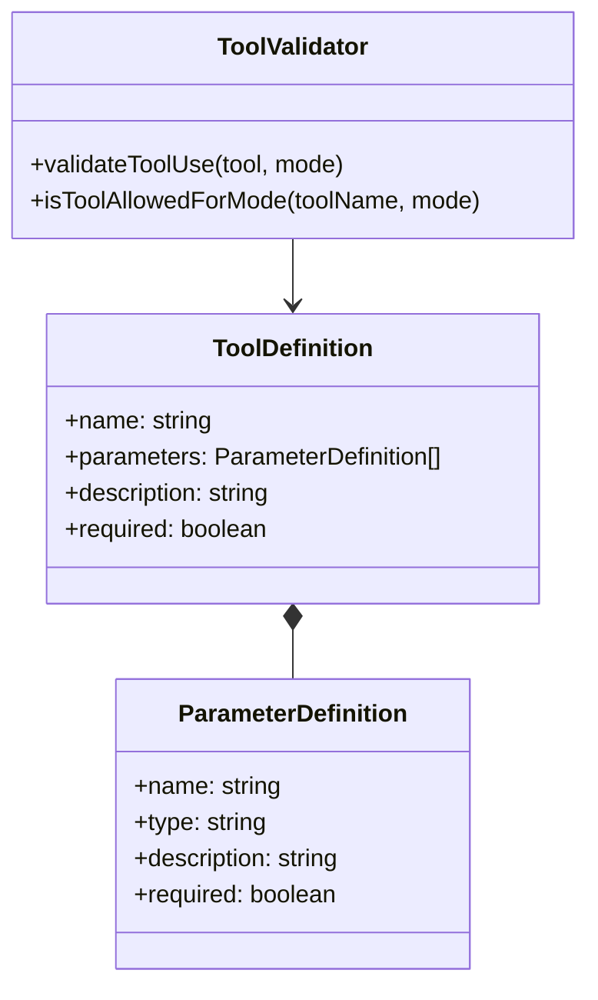
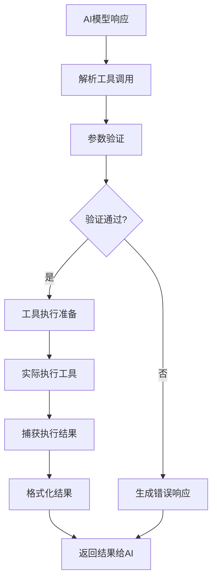
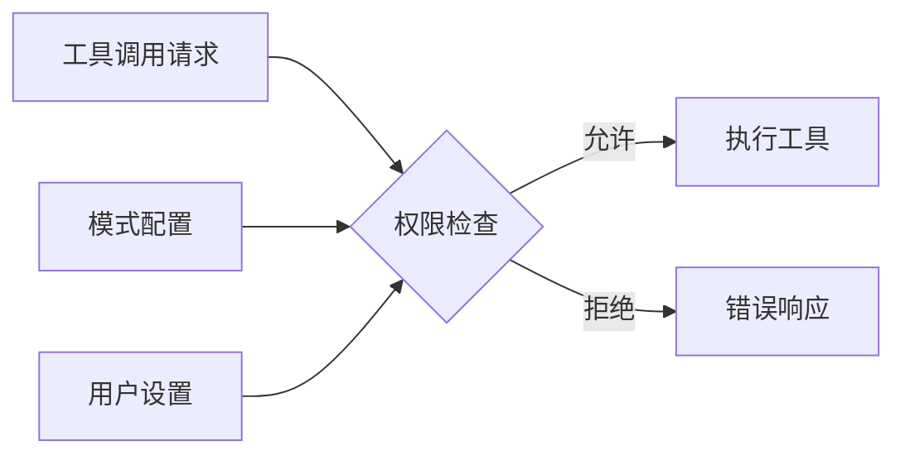
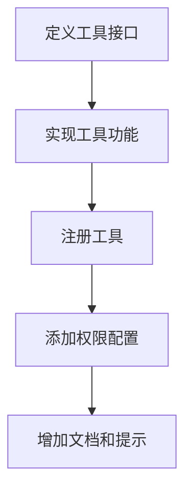
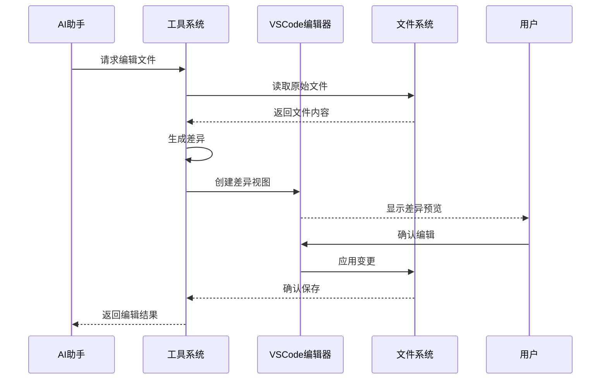
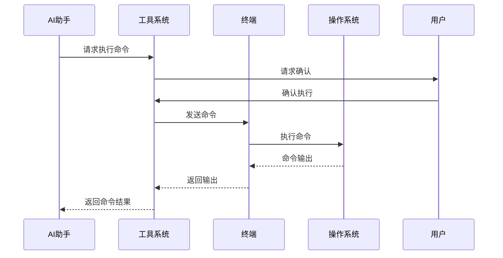

# Roo Code 工具系统深入分析

## 1. 工具系统概述

Roo Code扩展的核心能力之一是其丰富的工具系统，该系统允许AI助手执行各种操作，包括文件操作、终端命令执行、代码分析等功能。工具系统是构建在AI能力之上的实际执行层，让AI助手能够与VSCode环境和用户系统进行交互。

## 2. 工具系统架构

### 2.1 工具定义与注册

工具系统基于一系列预定义的工具，每个工具都有特定的功能和参数要求。工具的定义和验证机制在`src/core/mode-validator.ts`中实现，确保工具的安全使用。

### 2.2 工具执行流程

工具的执行流程从AI模型响应中识别工具调用开始，经过参数验证、执行准备、实际执行，最后将结果反馈给AI进行后续处理。

## 3. 核心工具分析

### 3.1 文件操作工具

#### 3.1.1 读取文件工具

**功能单元**: 允许AI助手读取文件内容

**输入参数**:
- `file_path`: 要读取的文件路径
- `start_line`(可选): 开始行号
- `end_line`(可选): 结束行号
- `should_read_entire_file`(可选): 是否读取整个文件

**处理步骤**:
1. 验证文件路径和访问权限
2. 检查文件是否存在
3. 读取指定范围的文件内容
4. 处理二进制文件检测

**输出结果**:
- 文件内容文本
- 文件范围信息

**副作用**:
- 文件系统访问

#### 3.1.2 编辑文件工具

**功能单元**: 允许AI助手编辑现有文件

**输入参数**:
- `file_path`: 要编辑的文件路径
- `edit_content`: 编辑内容
- `edit_description`: 编辑描述

**处理步骤**:
1. 验证文件路径和写入权限
2. 读取原始文件内容
3. 生成差异并应用编辑
4. 保存修改后的文件
5. 可能需要用户确认

**输出结果**:
- 编辑应用状态
- 编辑后的文件内容摘要

**副作用**:
- 修改文件系统
- 创建差异视图

### 3.2 终端操作工具

#### 3.2.1 执行命令工具

**功能单元**: 允许AI助手在终端执行命令

**输入参数**:
- `command`: 要执行的命令
- `cwd`(可选): 工作目录
- `require_confirmation`: 是否需要用户确认

**处理步骤**:
1. 验证命令安全性
2. 用户确认(如果需要)
3. 在集成终端中执行命令
4. 捕获命令输出
5. 处理退出代码和错误

**输出结果**:
- 命令执行输出
- 执行状态(成功/失败)

**副作用**:
- 执行系统命令
- 可能的系统状态变更

### 3.3 代码分析工具

#### 3.3.1 代码搜索工具

**功能单元**: 允许AI助手在项目中搜索代码

**输入参数**:
- `query`: 搜索关键词或正则表达式
- `file_pattern`(可选): 文件匹配模式
- `case_sensitive`(可选): 是否区分大小写

**处理步骤**:
1. 构建搜索参数
2. 执行ripgrep搜索
3. 收集和格式化结果

**输出结果**:
- 匹配的代码行
- 匹配文件和位置信息

**副作用**:
- 无显著副作用

#### 3.3.2 代码定义分析工具

**功能单元**: 允许AI助手分析代码定义和结构

**输入参数**:
- `file_path`: 要分析的文件路径
- `query_type`(可选): 分析类型

**处理步骤**:
1. 使用tree-sitter解析代码
2. 提取结构信息(函数、类、变量等)
3. 格式化分析结果

**输出结果**:
- 代码结构信息
- 定义列表

**副作用**:
- 无显著副作用

### 3.4 Web相关工具

#### 3.4.1 浏览器操作工具

**功能单元**: 允许AI助手获取网页内容

**输入参数**:
- `url`: 要访问的URL
- `action`: 浏览器动作类型

**处理步骤**:
1. 验证URL安全性
2. 执行浏览器操作(获取内容、截图等)
3. 处理响应和错误

**输出结果**:
- 网页内容或截图
- 状态信息

**副作用**:
- 网络请求
- 可能的缓存创建

#### 3.4.2 网络搜索工具

**功能单元**: 允许AI助手执行网络搜索

**输入参数**:
- `query`: 搜索查询

**处理步骤**:
1. 准备搜索请求
2. 发送到搜索API
3. 处理和格式化搜索结果

**输出结果**:
- 搜索结果列表
- 摘要和链接

**副作用**:
- 网络请求

## 4. 工具权限与安全机制

### 4.1 权限控制

工具系统实现了精细的权限控制机制，确保只有合适的工具能在特定模式下使用。

### 4.2 安全验证

为确保安全，工具系统实现了多层验证机制：

1. **路径验证**: 确保文件操作不超出工作区范围
2. **命令验证**: 限制可执行的命令类型
3. **参数验证**: 检查参数有效性和安全性
4. **用户确认**: 关键操作需要用户确认

## 5. 工具结果处理

### 5.1 结果格式化

工具执行的结果需要被格式化为AI能够理解的形式，这通常是通过特定格式的文本或结构化数据实现的。

### 5.2 错误处理

工具执行过程中可能出现各种错误，系统实现了统一的错误处理机制：

1. **类型化错误**: 将错误分类为权限错误、执行错误等
2. **用户友好消息**: 生成易于理解的错误消息
3. **建议修复**: 在可能的情况下提供修复建议

## 6. 工具系统扩展性

Roo Code的工具系统设计得具有良好的扩展性，支持添加新工具或修改现有工具的行为。

### 6.1 添加新工具的流程

### 6.2 自定义工具配置

系统支持通过配置调整工具行为，包括：

1. **权限级别**: 控制工具可用的模式
2. **默认参数**: 设置工具默认行为
3. **超时设置**: 控制工具执行时间

## 7. 工具系统的挑战与限制

### 7.1 安全与权限平衡

工具系统面临的主要挑战是在功能强大和安全可控之间取得平衡。太严格的限制会削弱AI助手的能力，而太宽松的权限可能带来安全风险。

### 7.2 性能考量

某些工具(如大型代码库搜索)可能消耗大量资源，系统需要实现资源限制和优化机制。

### 7.3 用户体验

工具执行通常需要时间，维持良好的用户体验需要适当的进度指示和反馈机制。

## 8. 工具执行示例

### 8.1 编辑文件示例

### 8.2 执行命令示例

## 9. 未来发展方向

### 9.1 工具自定义能力

未来可能支持用户自定义工具或调整现有工具的行为，增强系统的灵活性。

### 9.2 工具链组合

支持将多个工具组合成工具链，执行更复杂的操作序列。

### 9.3 上下文感知工具

开发上下文感知能力，使工具能根据当前编辑环境智能调整行为。

## 10. 总结

Roo Code的工具系统是扩展功能的关键组成部分，它通过桥接AI能力和实际系统操作，使AI助手能够执行实际的代码编辑、分析和执行任务。该系统设计灵活且安全可控，为用户提供了强大的AI辅助开发体验。